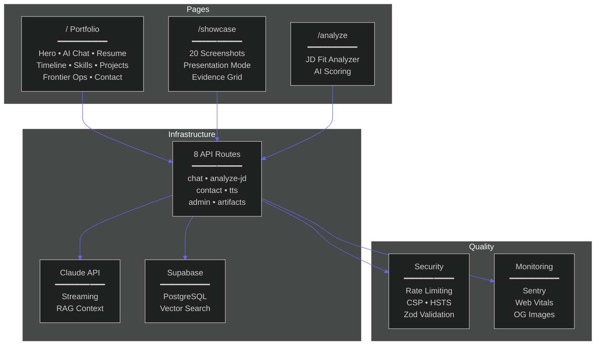

<div align="center">


<br/>

[](https://dicoangelo.metaventionsai.com)
[](https://dicoangelo.metaventionsai.com/showcase)
[](https://github.com/Dicoangelo)

<br/>

[](https://nextjs.org/)
[](https://react.dev/)
[](https://www.typescriptlang.org/)
[](https://tailwindcss.com/)
[](https://vercel.com)

</div>


## The Proof

This isn't a portfolio template. Every line of the **32,129 lines of TypeScript** was written by AI agents orchestrated through [meta-vengine](https://github.com/Dicoangelo/meta-vengine) — a self-improving routing engine that scores decisions, learns from sessions, and evolves its own configuration.

The site itself is evidence of the systems it describes.

<div align="center">

| Metric | Value |
|:-------|------:|
| **Lines of Code** | 32,129 |
| **Components** | 59 |
| **Custom Hooks** | 14 |
| **API Routes** | 8 |
| **Commits** | 188 |
| **Dependencies** | 19 |
| **Manual Lines Written** | 0 |

</div>


## Architecture

<div align="center">



</div>


## Pages

### `/` — Portfolio

The main page is a single-page application with 10 sections, adaptive scroll-aware navigation, and a command palette (`Cmd+K`).

| Feature | What It Does |
|---------|-------------|
| **AI Chat** | Claude-powered Q&A about my background — streaming responses, RAG context from 700+ indexed chunks |
| **JD Fit Analyzer** | Paste a job description, get AI-scored fit analysis with gap identification |
| **Frontier Ops Score** | 5-dimension radar chart — Agentic Fluency, Failure Modeling, Seam Design, Attention Calibration, Evolution Rate |
| **Command Palette** | `Cmd+K` navigation with search, theme toggle, section jumps |
| **Career Timeline** | Interactive professional journey with expandable details |
| **Keyboard Shortcuts** | Press `?` for full shortcut reference |
| **Theme Toggle** | Light/dark with persistent preference and smooth transitions |
| **GSAP Animations** | Scroll reveals, stagger grids, parallax — respects `prefers-reduced-motion` |

### `/showcase` — Production AI Showcase

A visual gallery proving that the AI systems described on the portfolio actually exist and work.

| Feature | What It Does |
|---------|-------------|
| **20 Screenshots** | Across 5 systems — Antigravity OS (13), ResearchGravity (2), UCW Dashboard (3), Command Center (1), Metaventions AI (1) |
| **Presentation Mode** | Full walkthrough with talking points sidebar, keyboard nav (←→), auto-advance timer, ALL/HIGHLIGHTS playlist |
| **Search & Filter** | Real-time search with category filters (Monitoring, Orchestration, AI/ML, RAG, Cloud) |
| **Lightbox** | Full-screen viewer with crossfade transitions and body scroll lock |
| **Evidence Grid** | 16 Anomaly Stats, 4 Live Sites, 20 GitHub Repos, 13 Certifications, 4 Docker projects |


## Tech Stack

<div align="center">

| Layer | Technology | Why |
|:------|:-----------|:----|
| **Framework** | Next.js 16 (App Router) | Server components, streaming, edge runtime |
| **UI** | React 19 | Concurrent features, use() hook |
| **Language** | TypeScript 5 (strict) | Zero `any` tolerance |
| **Styling** | Tailwind CSS 4 | CSS variables, `data-theme` attribute |
| **Animations** | GSAP + ScrollTrigger | GPU-accelerated, scroll-driven |
| **3D** | Three.js + React Three Fiber | Systems network visualization |
| **AI** | Anthropic Claude API | Streaming chat, JD analysis |
| **Database** | Supabase (PostgreSQL) | Vector search, real-time |
| **Rate Limiting** | Upstash Redis | Sliding window per IP |
| **Voice** | Deepgram | Speech-to-text |
| **Validation** | Zod | Schema-first API contracts |
| **Error Tracking** | Sentry | Source maps, PII filtering |
| **Hosting** | Vercel | Edge network, auto-deploy |

</div>

## Project Structure

```
dicoangelo.metaventions/
├── src/
│   ├── app/
│   │   ├── page.tsx                # Main portfolio (10 sections)
│   │   ├── layout.tsx              # Root layout + metadata
│   │   ├── showcase/               # Production AI Showcase
│   │   │   ├── page.tsx            # Page scaffold + state management
│   │   │   ├── data.ts             # 20 items, 16 stats, 20 repos, 13 certs
│   │   │   ├── ShowcaseGallery.tsx # Search, filter, system-grouped cards
│   │   │   ├── PresentationMode.tsx# Keyboard nav, auto-advance, playlists
│   │   │   ├── Lightbox.tsx        # Full-screen crossfade viewer
│   │   │   ├── AnomalyStats.tsx    # Animated count-up grid
│   │   │   ├── GitHubRepos.tsx     # Public (11) + Private (9) tables
│   │   │   ├── LiveSites.tsx       # 4 production URLs
│   │   │   ├── Certifications.tsx  # AWS (5) + Microsoft (6) + Other (2)
│   │   │   ├── DockerEvidence.tsx  # 4 containerized projects
│   │   │   └── TechStackRibbon.tsx # 15 technology chips
│   │   ├── analyze/                # JD Fit Analyzer
│   │   ├── frontier-ops/           # Interactive Frontier Ops
│   │   ├── see-more/               # Extended projects
│   │   └── api/                    # 8 API routes
│   │       ├── chat/               # Claude streaming + RAG
│   │       ├── analyze-jd/         # JD analysis pipeline
│   │       ├── contact/            # Form submission
│   │       ├── tts/                # Text-to-speech
│   │       ├── deepgram-token/     # Voice auth
│   │       ├── artifacts/          # Dynamic OG images
│   │       ├── metacognitive/      # Confidence routing
│   │       └── admin/              # Admin endpoints
│   ├── components/                 # 59 components
│   │   ├── sections/               # 10 page sections
│   │   ├── Nav.tsx                 # Scroll-aware, Next.js Link routing
│   │   ├── CommandPalette.tsx      # Cmd+K fuzzy search
│   │   ├── SectionNav.tsx          # Dot-style scroll indicator
│   │   ├── ThemeProvider.tsx       # Light/dark via data-theme
│   │   └── Footer.tsx             # Quick links, social, stats
│   ├── hooks/                      # 14 custom hooks
│   │   ├── useScrollReveal.ts      # IntersectionObserver animations
│   │   ├── useCountAnimation.ts    # Animated number count-up
│   │   ├── useParallax.ts          # GPU-accelerated parallax
│   │   ├── useFocusTrap.ts         # Modal accessibility
│   │   └── useReducedMotion.ts     # Motion preference detection
│   └── lib/                        # AI config, schemas, utilities
├── public/
│   └── showcase/                   # 20 screenshot assets (PNG + GIF)
├── tests/e2e/                      # Playwright E2E tests
└── next.config.ts                  # Sentry + Next.js config
```


## Security

| Layer | Implementation |
|:------|:--------------|
| **Rate Limiting** | Upstash Redis — 10 req/min chat, 5 req/min analyzer |
| **Input Validation** | Zod schemas on every API endpoint |
| **Headers** | CSP, HSTS (1yr), X-Frame-Options DENY, X-Content-Type-Options |
| **Error Tracking** | Sentry with automatic PII scrubbing |
| **Type Safety** | TypeScript strict — no implicit any, no unchecked index |

## Development

```bash
git clone https://github.com/Dicoangelo/dicoangelo.metaventions.git
cd dicoangelo.metaventions
npm install

# Required env vars
cp .env.example .env.local
# ANTHROPIC_API_KEY, NEXT_PUBLIC_SUPABASE_URL, UPSTASH_REDIS_REST_*

npm run dev          # localhost:3000
npm run build        # Production build
npm run lint         # ESLint
npm test             # Vitest
npm run test:e2e     # Playwright
```


## The Ecosystem

This portfolio is one node in a larger sovereign AI infrastructure:

<div align="center">

| Project | What It Is | Link |
|:--------|:-----------|:-----|
| **Antigravity OS** | Sovereign AI OS — 33K LOC, multi-agent orchestration | [app.metaventionsai.com](https://app.metaventionsai.com) |
| **meta-vengine** | Self-improving routing engine — DQ scoring, co-evolution | [GitHub](https://github.com/Dicoangelo/meta-vengine) |
| **ResearchGravity** | 21 MCP tools, knowledge graph, hybrid search | [GitHub](https://github.com/Dicoangelo/ResearchGravity) |
| **antigravity-coordinator** | Multi-agent orchestration — 212 tests, 93.1% routing | [GitHub](https://github.com/Dicoangelo/antigravity-coordinator) |
| **UCW** | Universal Cognitive Wallet — 174K events across 6 platforms | [GitHub](https://github.com/Dicoangelo/ucw) |
| **Command Center** | 17-tab real-time dashboard — SSE streaming, 131K events | [GitHub](https://github.com/Dicoangelo/claude-command-center) |
| **Metaventions AI** | Company landing page | [metaventionsai.com](https://metaventionsai.com) |
| **Jordan Signature Event** | Client delivery — production website | [thesignatureevent.metaventionsai.com](https://thesignatureevent.metaventionsai.com) |

</div>

---

<div align="center">


<br/><br/>

[](https://dicoangelo.metaventionsai.com)
[](https://www.linkedin.com/in/dico-angelo/)
[](https://www.npmjs.com/org/metaventionsai)
[](https://github.com/Dicoangelo)

</div>


