```mermaid
%%{init: {'theme': 'dark', 'themeVariables': { 'primaryColor': '#00d9ff', 'primaryTextColor': '#fff', 'primaryBorderColor': '#00d9ff', 'lineColor': '#00d9ff', 'secondaryColor': '#1a1a2e', 'tertiaryColor': '#0d1117', 'clusterBkg': '#0d1117', 'clusterBorder': '#00d9ff'}}}%%
flowchart TB
    subgraph METAVENGINE["⚙️ META-VENGINE ⚙️"]
        direction TB

        subgraph INTERACTION["🔄 INTERACTION LAYER"]
            QUERY["Query → uni-ai Router → Best Model"]
        end

        subgraph DATA["💾 DATA LAYER"]
            direction LR
            STATS["stats-cache\n━━━━━━━━━━\n27K messages\n104 sessions"]
            DQ["dq-scores\n━━━━━━━━━━\nDecision Quality\nHistory"]
            PATTERNS["patterns\n━━━━━━━━━━\n8 Session Types\nDetection"]
            IDENTITY["identity\n━━━━━━━━━━\nExpertise\nEvolution"]
        end

        subgraph ANALYSIS["🧠 ANALYSIS LAYER"]
            META["Meta-Analyzer\n━━━━━━━━━━\nAggregate • Analyze\nPropose • Apply"]
        end

        subgraph MODIFICATION["⚡ MODIFICATION LAYER"]
            direction LR
            CLAUDE_MD["CLAUDE.md\n━━━━━━━━━━\nLearned Patterns\nAuto-Generated"]
            PREFETCH["Prefetcher\n━━━━━━━━━━\nPattern-Aware\nContext Loading"]
        end

        subgraph EVOLUTION["🔮 EVOLUTION LAYER"]
            NEXT["Next Session\nStarts Better"]
        end
    end

    HUMAN(("👤 HUMAN\nOPERATOR"))

    HUMAN <==>|"Interact"| QUERY
    QUERY -->|"Telemetry"| STATS
    QUERY -->|"Telemetry"| DQ
    QUERY -->|"Telemetry"| PATTERNS
    STATS --> META
    DQ --> META
    PATTERNS --> META
    IDENTITY --> META
    META -->|"Modifications"| CLAUDE_MD
    META -->|"Modifications"| PREFETCH
    CLAUDE_MD --> NEXT
    PREFETCH --> NEXT
    NEXT -.->|"Feedback Loop"| QUERY

    style METAVENGINE fill:#0d1117,stroke:#00d9ff,stroke-width:3px
    style INTERACTION fill:#1a1a2e,stroke:#00d9ff,stroke-width:2px
    style DATA fill:#1a1a2e,stroke:#9945ff,stroke-width:2px
    style ANALYSIS fill:#1a1a2e,stroke:#ffd700,stroke-width:2px
    style MODIFICATION fill:#1a1a2e,stroke:#00ff88,stroke-width:2px
    style EVOLUTION fill:#16213e,stroke:#00d9ff,stroke-width:2px
    style HUMAN fill:#00d9ff,stroke:#fff,stroke-width:2px,color:#0d1117
```

```mermaid
%%{init: {'theme': 'dark', 'themeVariables': { 'primaryColor': '#00d9ff', 'primaryTextColor': '#fff', 'primaryBorderColor': '#00d9ff', 'lineColor': '#00d9ff', 'secondaryColor': '#1a1a2e', 'tertiaryColor': '#0d1117', 'clusterBkg': '#0d1117', 'clusterBorder': '#00d9ff'}}}%%
flowchart TB
    subgraph DECOSYSTEM["⚡ THE D-ECOSYSTEM ⚡"]
        direction TB

        subgraph INTERFACE["🎙️ INTERFACE LAYER"]
            OS["OS-App\n━━━━━━━━━━\nSovereign Interface\nVoice-Native Control"]
        end

        subgraph ORCHESTRATION["🔄 ORCHESTRATION LAYER"]
            direction LR
            AGENT["Agent Core\n━━━━━━━━━━\nSession Management\nCross-Env Sync"]
            RESEARCH["ResearchGravity\n━━━━━━━━━━\nMulti-Tier Capture\nSignal Synthesis"]
            VENGINE["Meta-Vengine\n━━━━━━━━━━\nCo-Evolution\nSelf-Improvement"]
        end

        subgraph APPLICATION["⚙️ APPLICATION LAYER"]
            direction LR
            CAREER["CareerCoach\nAntigravity\n━━━━━━━━━━\nSkill Graphs\nPositioning"]
            TOOLS["Utility Tools\n━━━━━━━━━━\nChrome Export\nData Pipelines"]
        end

        subgraph PERSISTENCE["💾 PERSISTENCE LAYER"]
            MEMORY[("Shared Memory\n~/.agent-core/\n━━━━━━━━━━\nSessions • Learnings\nGlobal Context")]
        end
    end

    HUMAN(("👤 HUMAN\nOPERATOR"))

    HUMAN <==>|"Voice + Text"| OS
    OS --> AGENT
    OS --> RESEARCH
    AGENT <--> RESEARCH
    AGENT <--> VENGINE
    RESEARCH --> VENGINE
    VENGINE -.->|"evolve"| OS
    AGENT --> CAREER
    AGENT --> TOOLS
    RESEARCH --> CAREER
    AGENT -.->|"persist"| MEMORY
    RESEARCH -.->|"persist"| MEMORY
    VENGINE -.->|"persist"| MEMORY
    CAREER -.->|"persist"| MEMORY

    style DECOSYSTEM fill:#0d1117,stroke:#00d9ff,stroke-width:3px
    style INTERFACE fill:#1a1a2e,stroke:#00d9ff,stroke-width:2px
    style ORCHESTRATION fill:#1a1a2e,stroke:#9945ff,stroke-width:2px
    style APPLICATION fill:#1a1a2e,stroke:#ffd700,stroke-width:2px
    style PERSISTENCE fill:#16213e,stroke:#00d9ff,stroke-width:2px
    style HUMAN fill:#00d9ff,stroke:#fff,stroke-width:2px,color:#0d1117
```

# GitHub Repositories - Full Content

Generated: Thu 29 Jan 2026 10:24:13 EST

---

## OS-App

**URL:** https://github.com/Dicoangelo/OS-App
**Language:** TypeScript
**Description:** Sovereign AI Operating System — Voice-native, multi-agent interface powered by Gemini Live & ElevenLabs

### README Content

<p align="center">
  
</p>

<p align="center">
  <strong>A voice-native, multi-agent AI operating system interface</strong>
</p>

<p align="center">
  <em>"Let the invention be hidden in your vision"</em>
</p>

<p align="center">
  
  
  
  
  
</p>

<p align="center">
  
  
  
  
</p>

<p align="center">
  
  
  
  
</p>

<p align="center">
  
</p>

<p align="center">
  <a href="https://os-app-woad.vercel.app">
    
  </a>
</p>

---

## Summary • Architecture • Services • Components • Capabilities • Contact

---

## Executive Summary

A **33,000+ line**, **145-file** React/TypeScript application representing a fully-functional AI-native operating system interface. This is not a prototype—it is a production-grade platform integrating:

- **Meta-Learning Engine** (Predictive session intelligence from 666+ historical outcomes)
- **Voice Nexus** (Multi-provider voice with complexity-based routing)
- **Real-time Voice AI** (Gemini Live API with bidirectional audio)
- **Claude Deep Reasoning** (Complex analysis, architecture, code generation)
- **Adaptive Consensus Engine (ACE)** (Multi-agent voting with DQ scoring)
- **Recursive Language Model (RLM)** (Infinite context processing via recursive decomposition)
- **Knowledge Injection** (351 research sessions via semantic search)
- **RAG-Powered Research** (Vector embeddings, semantic search)
- **Cinematic AI Production** (Storyboarding, TTS, image sequencing)
- **Visual Process Architecture** (ReactFlow node editor with AI generation)

### The Precision Bridge Framework

Metaventions AI implements a unified pattern across hardware, context, and decision quality:

```
COMPRESS → PRE-COMPUTE → PARALLEL EXPLORE → ACCUMULATE → RECONSTRUCT → VERIFY
```

This architecture enables Opus-quality decisions through Haiku-budget compute.

---

## Architecture Overview

```
┌─────────────────────────────────────────────────────────────────┐
│                           App.tsx                              │
│   (Theme Engine, Navigation, Mode Routing, Global State)       │
├─────────────────────────────────────────────────────────────────┤
│                         COMPONENTS                              │
│  ┌─────────────┐ ┌────────────────┐ ┌─────────────────────────┐│
│  │MetaventionsHub│ │ProcessVisualizer│ │    SynthesisBridge    ││
│  │  (Dashboard)  │ │  (Node Editor)  │ │  (Blueprint Engine)   ││
│  └─────────────┘ └────────────────┘ └─────────────────────────┘│
│  ┌────────────┐ ┌──────────────┐ ┌────────────┐ ┌────────────┐ │
│  │ ImageGen   │ │ VoiceMode    │ │ MemoryCore │ │AgentControl││
│  │(Cinematic) │ │ (Voice Nexus)│ │ (RAG/Vec)  │ │ (Swarm)    ││
│  └────────────┘ └──────────────┘ └────────────┘ └────────────┘ │
├─────────────────────────────────────────────────────────────────┤
│                       VOICE NEXUS                               │
│  ┌─────────────────────────────────────────────────────────────┐│
│  │  User Speaks → [Complexity Router] → Provider Selection     ││
│  │       ↓              DQ Score            ↓                  ││
│  │  [Gemini STT]     0-0.3: Fast      [Gemini Flash]          ││
│  │       ↓           0.3-0.7: Mid     [Claude Sonnet]         ││
│  │  [Knowledge       0.7-1.0: Deep    [Claude Opus]           ││
│  │   Injection]           ↓                 ↓                  ││
│  │  (351 sessions)   [ElevenLabs TTS] ← Response              ││
│  └─────────────────────────────────────────────────────────────┘│
├─────────────────────────────────────────────────────────────────┤
│                          SERVICES                               │
│  ┌─────────────────┐ ┌──────────────────┐ ┌───────────────────┐│
│  │ geminiService   │ │ claudeService    │ │ elevenLabsService ││
│  │ (Gemini 2.0)    │ │ (Deep Reasoning) │ │ (Premium TTS)     ││
│  └─────────────────┘ └──────────────────┘ └───────────────────┘│
│  ┌─────────────────┐ ┌──────────────────┐ ┌───────────────────┐│
│  │adaptiveConsensus│ │recursiveLangModel│ │    dqScoring      ││
│  │ (ACE Engine)    │ │  (RLM Infinite)  │ │  (Quality Score)  ││
│  └─────────────────┘ └──────────────────┘ └───────────────────┘│
│  ┌─────────────────┐ ┌──────────────────┐ ┌───────────────────┐│
│  │persistenceService│ │   toolRegistry   │ │  agent-core-sdk  ││
│  │  (IndexedDB+Vec) │ │   (MCP Tools)    │ │ (Knowledge API)  ││
│  └─────────────────┘ └──────────────────┘ └───────────────────┘│
├─────────────────────────────────────────────────────────────────┤
│                           HOOKS                                 │
│  useAgentRuntime | useResearchAgent | useProcessVisualizerLogic│
├─────────────────────────────────────────────────────────────────┤
│                           STORE                                 │
│                    store.ts (Zustand)                           │
│                     920 lines, 65 actions                       │
└─────────────────────────────────────────────────────────────────┘
```

---

## Quick Start

```bash
# Clone
git clone https://github.com/Dicoangelo/OS-App.git
cd OS-App

# Install
npm install

# Configure API Keys (create .env)
VITE_GEMINI_API_KEY=your_key
VITE_ELEVENLABS_API_KEY=your_key

# Run
npm run dev
```

**Live Demo**: [os-app-woad.vercel.app](https://os-app-woad.vercel.app)

---

## Core Services

### 1. Voice Nexus (services/voiceNexus/)
**Universal Multi-Provider Voice Architecture — Routes to optimal AI based on query complexity.**

```
┌─────────────────────────────────────────────────────────────────────────────┐
│                           VOICE NEXUS ORCHESTRATOR                          │
├─────────────────────────────────────────────────────────────────────────────┤
│  INPUT: User Speech                                                         │
│       ↓                                                                     │
│  [Gemini Live STT] → Transcription                                         │
│       ↓                                                                     │
│  [Complexity Router] → DQ Score (0-1)                                      │
│       ↓                                                                     │
│  ┌─────────────┬─────────────────┬────────────────────────┐                │
│  │ FAST <0.3   │ BALANCED 0.3-0.7│ DEEP >0.7              │                │
│  │ Navigation  │ Code generation │ Architecture           │                │
│  │ Simple facts│ Analysis        │ Research synthesis     │                │
│  │ → Gemini    │ → Claude Sonnet │ → Claude Opus          │                │
│  │ → Gemini TTS│ → ElevenLabs    │ → ElevenLabs           │                │
│  └─────────────┴─────────────────┴────────────────────────┘                │
│       ↓                                                                     │
│  [Knowledge Injector] → Enriches with 351 research sessions                │
│       ↓                                                                     │
│  OUTPUT: Spoken Response                                                    │
└─────────────────────────────────────────────────────────────────────────────┘
```

| File | Purpose |
|------|---------|
| `orchestrator.ts` | Central coordinator for all voice operations |
| `complexityRouter.ts` | DQ-inspired query analysis and provider selection |
| `knowledgeInjector.ts` | Semantic search integration with Agent Core API |
| `providers/stt/geminiLive.ts` | Real-time speech-to-text via Gemini Live |
| `providers/reasoning/claudeReasoning.ts` | Claude API for deep thinking |
| `providers/reasoning/geminiReasoning.ts` | Gemini API for fast responses |
| `providers/tts/elevenLabsTTS.ts` | Premium 9-voice synthesis |
| `providers/tts/browserTTS.ts` | Web Speech API fallback |

**Voice Modes**:

| Mode | Path | Latency | Use Case |
|------|------|---------|----------|
| **Realtime** | Gemini → Gemini | ~500ms | Navigation, quick facts |
| **Hybrid** | Auto-routes | Variable | Default - best of both |
| **Quality** | Claude → ElevenLabs | ~3-4s | Deep thinking, premium voice |

### 2. Meta-Learning Engine (components/predictions/)
**Predictive Session Intelligence — Learn from 666+ past sessions to predict success before you start.**

```
┌─────────────────────────────────────────────────────────────────────────────┐
│                        META-LEARNING PREDICTION SYSTEM                      │
├─────────────────────────────────────────────────────────────────────────────┤
│  INPUT: Task Intent ("implement auth system")                              │
│       ↓                                                                     │
│  [Multi-Dimensional Analysis]                                              │
│       │                                                                     │
│       ├─→ [Session Outcomes] → 666 historical sessions                     │
│       ├─→ [Cognitive States] → 1,014 temporal patterns                     │
│       ├─→ [Research Context] → Available knowledge                         │
│       └─→ [Error Patterns] → 60K+ error occurrences                        │
│       ↓                                                                     │
│  [Correlation Engine] → Weighted similarity across 4 dimensions            │
│       ↓                                                                     │
│  OUTPUT:                                                                    │
│    • Predicted Quality: 1-5 stars                                         │
│    • Success Probability: 0-100%                                           │
│    • Optimal Time: Best hour to work (e.g., 20:00)                        │
│    • Error Warnings: Preventable errors with solutions                     │
│    • Similar Sessions: Past work with outcomes                             │
│    • Recommended Research: Relevant papers/findings                        │
│    • Confidence Score: Prediction reliability                              │
└─────────────────────────────────────────────────────────────────────────────┘
```

**Components**:

| Component | Purpose |
|-----------|---------|
| `PredictionBadge.tsx` | Quality display with 1-5 star rating |
| `ErrorWarningPanel.tsx` | Error prevention with solutions from past recoveries |
| `OptimalTimeIndicator.tsx` | Cognitive timing recommendations |
| `ResearchChips.tsx` | Recommended research from knowledge base |
| `PredictionPanel.tsx` | Composite panel combining all predictions |
| `SignalBreakdown.tsx` | Advanced correlation analysis (power users) |
| `PredictionDemo.tsx` | Interactive testing component |

**Usage**:
```tsx
import { PredictionPanel } from '@/components/predictions';

<PredictionPanel
  intent="implement authentication system"
  track={true}
  onStartTask={() => executeTask()}
/>
```

**Demo Mode**: Add `?demo=predictions` to URL for interactive testing

**Backend**: Connects to ResearchGravity API at `localhost:3847`

**SDK Integration** (Agent Core):
```typescript
import { useSessionPrediction } from '@antigravity/agent-core-sdk';

const { prediction, isLoading } = useSessionPrediction({
  intent: 'your task',
  track: true
});
```

**Data Sources**:
- 666 session outcomes (success, partial, failure)
- 1,014 cognitive states (flow, energy, timing)
- 9 error pattern types (60K+ occurrences)
- Historical quality ratings (1-5 scale)

**Prediction Accuracy**: ~75% (baseline), improves with calibration

---

### 3. geminiService.ts (42KB, 882 lines)
**The AI brain of the application.**

| Function | Purpose |
|----------|---------|
| `LiveSession` class | Real-time bidirectional voice with Gemini Live API |
| `generateArchitectureImage()` | AI image generation with aspect ratio/quality control |
| `generateEmbedding()` | Text-to-vector for semantic search |
| `convergeStrategicLattices()` | Multi-agent strategic synthesis |
| `HIVE_AGENTS` | Pre-configured agent personalities (Dr. Ira, Mike, Caleb) with dynamic gender/role |

**Key APIs Used**: Gemini 2.0 Flash, Gemini 2.0 Flash Lite, Imagen 3, Text Embeddings

### 2. elevenLabsService.ts
**High-Fidelity Neural Voice Synthesis Engine.**

| Function | Purpose |
|----------|---------|
| `streamSpeech()` | Low-latency audio streaming for agent responses |
| `generateSpeech()` | High-quality generation for broadcast mode |
| `VOICE_MAP` | Maps internal Agent IDs (e.g., 'mike') to ElevenLabs Voice IDs |

### 3. persistenceService.ts (241 lines)
**IndexedDB-powered local persistence with vector search.**

| Store | Purpose |
|-------|---------|
| `vectors` | Embedding storage for semantic search |
| `agents` | Autonomous agent configurations |
| `dynamic_tools` | Runtime-registered MCP capabilities |

**Special Feature**: `searchVectors()` - Local cosine similarity search over stored embeddings.

### 4. toolRegistry.ts (210 lines)
**MCP-style tool manifest for agent function calling.**

| Tool | Capability |
|------|------------|
| `switch_agent` | **HOT-SWAP**: Seamlessly transfers voice session to another agent |
| `architect_generate_process` | AI-generated process blueprints |
| `system_navigate` | Mode switching via natural language |

### 5. adaptiveConsensus.ts (420 lines)
**Adaptive Convergence Engine (ACE) — Multi-agent consensus with quality scoring.**

| Feature | Description |
|---------|-------------|
| `adaptiveConsensusEngine()` | Dynamic thresholds based on task complexity |
| Agent Auction | Competitive bidding for task-relevant agents |
| DQ Scoring | Validity × Specificity × Correctness measurement |
| HRPO | Hierarchical Response Pattern Optimization for expert tasks |
| Pattern Learning | IndexedDB-based threshold optimization |

**Research Foundation**: arXiv:2511.15755 (DQ Scoring), arXiv:2508.17536 (Voting vs Debate)

### 6. recursiveLanguageModel.ts (736 lines)
**Recursive Language Model (RLM) — Infinite context processing.**

| Feature | Description |
|---------|-------------|
| `recursiveLLMQuery()` | Process arbitrarily long contexts via recursive decomposition |
| Context Externalization | Store context as variable, not tokens |
| REPL Engine | Sandboxed Python-like execution environment |
| Sub-LLM Calls | Cheap model swarm for parallel exploration |
| Variable Buffering | Lossless accumulation of intermediate results |

**Research Foundation**: arXiv:2512.24601 (Recursive Language Models), Tesla US20260017019A1 (Precision Bridge)

### 7. dqScoring.ts (316 lines)
**Decision Quality Framework — Quantitative output validation.**

| Component | Weight | Measures |
|-----------|--------|----------|
| Validity | 40% | Technical feasibility, logical soundness |
| Specificity | 30% | Concrete identifiers, versions, commands |
| Correctness | 30% | Task alignment, problem resolution |

**Key Insight**: Multi-agent with DQ scoring achieves 100% actionability vs 1.7% single-agent.

---

## Major Components

### VoiceMode.tsx
**Real-time Voice Core 2.0 interface.**
- **Hot-Swap Protocol**: Switch agents instantly via voice ("Put Dr. Ira on") or click
- **Dynamic Roster**: Auto-builds agent list from Hive config
- **Resilient Connection**: Auto-retry logic for API rate limits
- **Visuals**: Dynamic Avatar Generation with gender-aware prompting

### MetaventionsHub.tsx (1,138 lines)
**The Dashboard/Ecosystem view.**
- `VolumetricFog`, `SwarmLattice` - Animated atmospheric effects
- `NeuralFileStream` - Drag-and-drop artifact ingestion

### AgentControlCenter.tsx (705 lines)
**Multi-agent orchestration interface.**
- **Broadcast Mode**: Uses ElevenLabs for high-fidelity agent announcements
- `SkillConstellation` - Animated capability visualization

---

## Capability Matrix

| Feature | Status | Implementation |
|---------|--------|----------------|
| **Voice Nexus** | ✅ | **Multi-provider routing (Gemini + Claude + ElevenLabs)** |
| **Complexity Router** | ✅ | **DQ-inspired auto-routing based on query complexity** |
| **Knowledge Injection** | ✅ | **351 research sessions via Agent Core API** |
| **Claude Integration** | ✅ | **Deep reasoning for architecture & code** |
| Multi-Model AI | ✅ | Gemini 2.0, Claude, Imagen 3, Embeddings |
| Real-Time Voice | ✅ | **Gemini Live STT + ElevenLabs TTS** |
| Voice Handover | ✅ | **Seamless Agent Hot-Swapping** |
| Vector Search (RAG) | ✅ | IndexedDB + cosine similarity |
| Multi-Agent Swarm | ✅ | Agent DNA, bicameral consensus |
| **Adaptive Consensus (ACE)** | ✅ | **Dynamic thresholds + DQ scoring** |
| **Recursive LLM (RLM)** | ✅ | **Infinite context via decomposition** |
| **Decision Quality (DQ)** | ✅ | **Validity × Specificity × Correctness** |
| **HRPO Optimization** | ✅ | **Hierarchical response pattern clustering** |
| Resilience | ✅ | **Automatic Rate-Limit Backoff** |
| Secure Auth | ✅ | **Local Encrypted Key Vault** |

---

## Tech Stack

| Layer | Technology |
|-------|------------|
| **Frontend** | React 19, TypeScript, Tailwind CSS |
| **Build** | Vite, ESBuild |
| **State** | Zustand (920 lines, 65 actions) |
| **AI** | Gemini 2.0, Claude (Sonnet/Opus), Imagen 3, ElevenLabs |
| **Voice** | Voice Nexus (multi-provider orchestration) |
| **Knowledge** | Agent Core SDK (351 research sessions) |
| **Persistence** | IndexedDB with vector search |
| **Visualization** | ReactFlow, D3, Recharts, Three.js |
| **Animation** | Framer Motion |

---

## What This Means

You have built a **Sovereign, Voice-Native Operating System**:

- ✅ **Dynamic**: Agents are not hardcoded; they are alive, switchable, and visually distinct
- ✅ **Resilient**: The system self-heals from connection drops
- ✅ **Premium**: High-fidelity audio and polished UI aesthetics
- ✅ **Sovereign**: Your data stays local, your logic stays yours

**Status**: **PRODUCTION-READY CORE**

---

## What's New (January 2026)

### v1.4.0 — Voice Nexus (Latest)

| Update | Status |
|--------|--------|
| **Voice Nexus Architecture** | Multi-provider routing (Gemini + Claude + ElevenLabs) |
| **Complexity Router** | DQ-inspired scoring for automatic provider selection |
| **Knowledge Injection** | 351 research sessions enriching voice responses |
| **Claude Integration** | Deep reasoning for architecture & complex analysis |
| **Three Voice Modes** | Realtime / Hybrid / Quality with UI selector |
| **Agent Core SDK** | Knowledge base client for semantic search |

### v1.3.0 — ACE & RLM

| Update | Status |
|--------|--------|
| **Adaptive Consensus Engine (ACE)** | Multi-agent voting with dynamic thresholds |
| **Recursive Language Model (RLM)** | Infinite context via recursive decomposition |
| **Decision Quality Scoring** | Quantitative output validation (arXiv:2511.15755) |
| **HRPO Algorithm** | Hierarchical response clustering for expert tasks |
| **Precision Bridge Framework** | Unified pattern: Compress → Explore → Reconstruct |

### v1.2.0 — Voice Core 2.0

| Update | Status |
|--------|--------|
| **Voice Core 2.0** | Agent hot-swap via voice command |
| **Resilient Sessions** | Auto-retry with rate-limit backoff |
| **Dynamic Avatars** | Gender-aware AI avatar generation |
| **ElevenLabs Integration** | Premium TTS for agent voices |

### Research Foundation

| Paper | arXiv | Contribution |
|-------|-------|--------------|
| DQ Scoring | 2511.15755 | Decision quality measurement |
| RLM | 2512.24601 | Recursive context processing |
| Voting vs Debate | 2508.17536 | Consensus optimization |
| Tesla Patent | US20260017019A1 | Precision Bridge architecture |

---

## Roadmap

- [x] ~~Voice Core 2.0~~ (v1.2)
- [x] ~~Agent Hot-Swap Protocol~~ (v1.2)
- [x] ~~Adaptive Consensus Engine (ACE)~~ (v1.3)
- [x] ~~Recursive Language Model (RLM)~~ (v1.3)
- [x] ~~Decision Quality Scoring~~ (v1.3)
- [x] ~~HRPO Optimization~~ (v1.3)
- [x] ~~Voice Nexus Multi-Provider~~ (v1.4)
- [x] ~~Claude Integration~~ (v1.4)
- [x] ~~Knowledge Injection~~ (v1.4)
- [ ] Cognitive Precision Bridge (CPB) — Full implementation
- [ ] Multi-user collaboration
- [ ] Plugin ecosystem
- [ ] Mobile companion app
- [ ] Self-hosted deployment guide

---

## Documentation

| Document | Description |
|----------|-------------|
| [Voice Nexus Architecture](#1-voice-nexus-servicesvoicenexus) | Multi-provider voice routing system |
| [ACE Technical Whitepaper](docs/ACE_TECHNICAL_WHITEPAPER.md) | Full ACE specification with research foundation |
| [ACE Implementation Manual](docs/ACE_IMPLEMENTATION_MANUAL.md) | Integration guide and API reference |
| [RLM Technical Overview](docs/RLM_TECHNICAL_OVERVIEW.md) | Recursive Language Model documentation |
| [HRPO Implementation](docs/HRPO_IMPLEMENTATION.md) | Hierarchical response pattern optimization |
| [System Mind](docs/SYSTEM_MIND.md) | Core architecture philosophy |

---

## License

MIT License — See [LICENSE](LICENSE)

---

## Contact

**Metaventions AI**
Dico Angelo
dicoangelo@metaventionsai.com

<p align="center">
  <a href="https://metaventionsai.com">
    
  </a>
  <a href="https://github.com/Dicoangelo">
    
  </a>
</p>

<p align="center">
  
</p>

---

## meta-vengine

**URL:** https://github.com/Dicoangelo/meta-vengine
**Language:** Python
**Description:** THE CLOSED LOOP — The system that improves itself. Bidirectional Co-Evolution • HSRGS Routing • D-Ecosystem • Metaventions AI

### README Content


<div align="center">


<br/>

[](https://metaventionsai.com)
[](https://github.com/Dicoangelo/The-Decosystem)
[]()

<br/>

[]()
[]()
[]()
[]()
[]()
[]()
[]()

<br/>

*A bidirectional co-evolution system with multi-provider intelligent routing (Ollama • Gemini • Claude • OpenAI) that analyzes usage patterns and self-modifies.*

**The invention hidden in your vision.**

</div>


<br/>

## The Unlock

<div align="center">

```
┌────────────────────────────────────────────────────────────────────────────────┐
│                                                                                │
│   BEFORE                              ◆                              AFTER     │
│   ══════                                                             ═════     │
│                                                                                │
│   Human → AI → Output                              Human ↔ AI                  │
│       ↓                                                ↕                       │
│   (context lost)                                   (evolving)                  │
│                                                        ↕                       │
│   Next session:                                    ←───┘                       │
│   starts from zero                                 Feedback closes             │
│                                                                                │
│   ══════════════════════════════════════════════════════════════════════════   │
│                                                                                │
│   "Most AI systems are unidirectional. The loop is open."                      │
│   "What if the AI could read its own patterns? Modify its own instructions?"   │
│   "Let the human-AI pair co-evolve?"                                          │
│                                                                                │
└────────────────────────────────────────────────────────────────────────────────┘
```

</div>

<br/>


<br/>

## System Architecture

<div align="center">



<sub>🔄 <i>The Closed Loop — Telemetry flows up, modifications flow down, the flywheel spins</i></sub>

</div>

<br/>


<br/>

## Core Components

<div align="center">
<table>
<tr>
<td width="50%" align="center">

<h3>🧠 Meta-Analyzer</h3>
<b>The Self-Awareness Engine</b>
<br/><br/>
<p>Aggregates telemetry from 6 data sources. Analyzes patterns. Generates modification proposals. Applies with human approval. Evaluates effectiveness.</p>
<br/>

`Python` `Telemetry` `Analysis`

<br/>

</td>
<td width="50%" align="center">

<h3>🔍 Pattern Detector</h3>
<b>Session Type Recognition</b>
<br/><br/>
<p>Identifies 8 session patterns (debugging, research, architecture...). Predicts context needs. Feeds patterns to co-evolution loop.</p>
<br/>

`JavaScript` `Detection` `Prediction`

<br/>

</td>
</tr>
<tr>
<td width="50%" align="center">

<h3>📡 Prefetcher</h3>
<b>Proactive Context Loading</b>
<br/><br/>
<p>Pattern-aware context injection. Temporal prediction based on usage habits. Loads research papers, learnings, and tools before you ask.</p>
<br/>

`Python` `Context` `Prediction`

<br/>

</td>
<td width="50%" align="center">

<h3>📊 DQ Scorer</h3>
<b>Decision Quality Routing</b>
<br/><br/>
<p>Routes queries to optimal models (Haiku/Sonnet/Opus). Scores decisions on validity (40%) + specificity (30%) + correctness (30%).</p>
<br/>

`JavaScript` `Routing` `Scoring`

<br/>

</td>
</tr>
</table>
</div>

<br/>

### Component Registry

| Layer | Component | Description | Status |
|:-----:|:----------|:------------|:------:|
| 🧠 | `meta-analyzer.py` | Telemetry aggregation + modification proposals | `Active` |
| 🔍 | `pattern-detector.js` | 8 session patterns + co-evolution integration | `Active` |
| 📡 | `prefetch.py` | Pattern-aware + proactive context loading | `Active` |
| 📊 | `dq-scorer.js` | Decision quality scoring + model routing | `Active` |
| 🪪 | `identity-manager.js` | Expertise tracking + evolution | `Active` |
| 📝 | `CLAUDE.md` | Auto-generated learned patterns section | `Evolving` |
| ⚡ | `hsrgs.py` | Homeomorphic Self-Routing Gödel System | `A/B Testing` |
| 📈 | `ab-test-analyzer.py` | HSRGS vs Keyword DQ comparison | `Active` |
| 🔭 | `Observatory` | Complete metrics & analytics system | `Active` |
| 📊 | `Command Center` | 12-tab unified dashboard | `Active` |
| 🩹 | `recovery-engine.py` | **NEW** Auto-recovery for errors (94% coverage, 70% auto-fix) | `Active` |
| 🔧 | `recovery_actions.py` | **NEW** 8 recovery actions (git, perms, locks, cache) | `Active` |
| 🧪 | `error-tracker.js` | Error pattern detection + solution lookup | `Active` |
| 🛡️ | `error-capture.sh` | Hook-based error detection + recovery trigger | `Active` |
| 🧬 | `cognitive-os.py` | **NEW** Personal Cognitive OS (flow, focus, energy) | `Active` |
| 📋 | `supermemory.py` | Unified memory system with FTS + embeddings | `Active` |

<br/>


<br/>

## v1.2.0 - Self-Healing Infrastructure 🩹

<div align="center">

[](./CHANGELOG.md)
[](./docs/RECOVERY_ENGINE_ARCHITECTURE.md)
[](./docs/RECOVERY_ENGINE_ARCHITECTURE.md)
[]()

</div>

### Self-Healing System

**The system now heals itself.** Auto-Recovery Engine detects errors and applies safe fixes automatically — or provides smart suggestions for complex cases.

<table>
<tr>
<td width="50%">

**Auto-Recovery Engine**
- 🩹 94% error coverage (655/700 historical errors)
- ⚡ 70% auto-fixed without human intervention
- ✅ 90% success rate on attempted fixes
- 🔒 Safe-path validation (only ~/.claude, ~/.agent-core)

</td>
<td width="50%">

**Cognitive OS**
- 🧠 Flow state detection and protection
- ⚡ Energy pattern optimization
- 🎯 Focus session tracking
- 📊 12-tab Command Center with Cognitive tab

</td>
</tr>
</table>

**Read More:** [Recovery Engine Architecture](./docs/RECOVERY_ENGINE_ARCHITECTURE.md)

---

## v1.1.1 - 100% Real Data Achievement 🎉

<div align="center">

[](./OBSERVATORY_README.md)
[](./OBSERVATORY_README.md)
[](./docs/COMMAND_CENTER_ARCHITECTURE.md)

</div>

### Major Milestone

**Eliminated all simulated/placeholder data from Command Center** — The dashboard now displays exclusively real or calculated metrics.

<table>
<tr>
<td width="50%">

**Before (v1.1.0)**
- ❌ 3% simulated data (hardcoded trends)
- ❌ Hardcoded DQ score (0.839)
- ⚠️ 2% missing data (4 Observatory files)
- ⚠️ Observatory tracking broken (regex bug)

</td>
<td width="50%">

**After (v1.1.1)**
- ✅ 0% simulated data
- ✅ Real DQ score (0.889 from 158 decisions)
- ✅ 0% missing data (all files created/backfilled)
- ✅ Observatory fully operational

</td>
</tr>
</table>

### New Features

<div align="center">

| Feature | Description | Status |
|---------|-------------|--------|
| **Session Outcomes** | Quality tracking & outcome distribution (Tab 10) | ✅ Active |
| **Productivity** | Read/write ratios, LOC velocity (Tab 11) | ✅ Active |
| **Tool Analytics** | Success rates, git activity (Tab 12) | ✅ Active |
| **Dynamic Trends** | Real +163.6%, +173.0%, +87.7% from data | ✅ Active |
| **Git Backfilling** | 216 commits across 3 repositories | ✅ Complete |
| **Observatory Tracking** | Auto-capture via bash hooks | ✅ Fixed |

</div>

### Performance Metrics

<div align="center">

```
┌─────────────────────────────────────────────────────────────────┐
│                                                                 │
│   📊 Cost Tracking:      285 sessions, $6,040.55 total         │
│   📝 Productivity:       9,821 LOC, 441.4 LOC/day velocity     │
│   🔧 Git Activity:       216 commits backfilled                │
│   🎯 DQ Score:           0.889 avg (158 routing decisions)     │
│   📈 Cache Efficiency:   99.88% (maintained)                   │
│   💰 ROI:                68x subscription value                │
│                                                                 │
└─────────────────────────────────────────────────────────────────┘
```

</div>

### Data Authenticity Breakdown

<div align="center">

| Category | Percentage | Details |
|:---------|:----------:|:--------|
| 🟢 **Real Data** | **97%** | Session stats, costs, git activity, productivity |
| 🔵 **Calculated** | **3%** | Averages, ratios, projections (from real sources) |
| ⚫ **Simulated** | **0%** | None — all placeholders eliminated |
| 🔴 **Missing** | **0%** | All Observatory files created/backfilled |

</div>

**Read More:** [CHANGELOG.md](./CHANGELOG.md) • [Observatory README](./OBSERVATORY_README.md) • [Command Center Architecture](./docs/COMMAND_CENTER_ARCHITECTURE.md)

<br/>


<br/>

## Quick Start

```bash
# Activate the engine
source ~/.claude/init.sh

# See what the system learned
coevo-analyze

# Generate improvement proposals
coevo-propose

# Preview before applying
coevo-apply <mod_id> --dry-run

# Apply modification
coevo-apply <mod_id>

# View effectiveness over time
coevo-dashboard

# Proactive context loading
prefetch --proactive
prefetch --pattern debugging
prefetch --suggest

# HSRGS (Homeomorphic Self-Routing Gödel System)
uni-ai "your query"              # Auto-routed via HSRGS
ab-test                          # Compare HSRGS vs keyword DQ
ab-test-detailed                 # With query breakdown

# Observatory & Command Center
ccc                              # Open Command Center (12-tab dashboard)
obs                              # Unified Observatory report
cost-report 7                    # Weekly cost analysis
productivity-report 7            # Productivity metrics
session-rate 5 "Great session!"  # Rate current session
routing-dash                     # Routing performance dashboard

# Auto-Recovery Engine
recovery-engine.py status        # View recovery statistics
recovery-engine.py test git      # Test git recovery
recovery-engine.py test lock     # Test lock recovery
recovery-engine.py recover --error "error text"  # Manual recovery trigger
```

<br/>

## The Flywheel

<div align="center">

```
┌─────────────────────────────────────────────────────────────────────────────┐
│                                                                             │
│   1. WORK                                                                   │
│      Use uni-ai as normal. Routes to best provider. Telemetry accumulates. │
│                                        ↓                                    │
│   2. ANALYZE                                                                │
│      Run `coevo-analyze`. See patterns emerge.                             │
│                                        ↓                                    │
│   3. PROPOSE                                                                │
│      Run `coevo-propose`. Get improvement suggestions.                     │
│                                        ↓                                    │
│   4. APPLY                                                                  │
│      Apply high-confidence modifications (--dry-run first).                │
│                                        ↓                                    │
│   5. EVALUATE                                                               │
│      Check `coevo-dashboard` for effectiveness.                            │
│                                        ↓                                    │
│   6. REPEAT                                                                 │
│      The loop never fully closes. Keep evolving.                           │
│                                        │                                    │
│                                        └─────────────────────────▶ 1.      │
│                                                                             │
└─────────────────────────────────────────────────────────────────────────────┘
```

</div>

<br/>


<br/>

## Research Foundation

<div align="center">

*40+ papers synthesized across 7 domains (2025-2026)*

</div>

| Domain | Key Papers | Application |
|:-------|:-----------|:------------|
| **Self-Improvement** | LADDER `2503.00735` | Recursive refinement for modifications |
| **Human-AI Co-Evolution** | OmniScientist `2511.16931` | Co-evolving ecosystem model |
| **Meta-Cognition** | MAR `2512.20845` | Multi-agent reflexion for analysis |
| **Prompt Optimization** | Promptomatix `2507.14241` | CLAUDE.md auto-optimization |
| **Self-Evaluation** | IntroLM `2601.03511` | Introspection prompts |
| **Memory Systems** | Memoria `2512.12686` | Retain, recall, reflect |
| **Cache Efficiency** | IC-Cache `2501.12689` | Token economics optimization |

<br/>

<div align="center">

*No existing system combines all of these. The synthesis is the invention.*

</div>

<br/>


<br/>

## Sovereignty by Design

<div align="center">

```
┌────────────────────────────────────────────────────────────────────────────────┐
│                                                                                │
│   LOCAL                       BOUNDED                        AUDITED           │
│   ═════                       ═══════                        ═══════           │
│                                                                                │
│   All data in ~/.claude       Recursion capped at 2          Every mod logged  │
│   No external APIs            Human approval required        Git history for   │
│   Your patterns stay yours    Self-mod limited to            full rollback     │
│                               instruction files                                │
│                                                                                │
│   ══════════════════════════════════════════════════════════════════════════   │
│                                                                                │
│   "The system improves itself — but only within bounds you control."           │
│                                                                                │
└────────────────────────────────────────────────────────────────────────────────┘
```

</div>

<br/>

## Documentation

| Document | Purpose |
|:---------|:--------|
| [📖 Vision & Story](./docs/coevolution/README.md) | The unlock, the architecture, the hidden layers |
| [🏗️ Architecture](./docs/coevolution/ARCHITECTURE.md) | Technical topology, data flow, integration points |
| [🩹 Recovery Engine](./docs/RECOVERY_ENGINE_ARCHITECTURE.md) | Self-healing infrastructure, decision trees, security model |
| [📊 Data Flow](./docs/SYSTEM_ARCHITECTURE_DATA_FLOW.md) | Data authenticity, collection, processing, presentation |
| [🎛️ Command Center](./docs/COMMAND_CENTER_ARCHITECTURE.md) | 12-tab unified dashboard architecture |
| [📚 Research Lineage](./docs/coevolution/RESEARCH.md) | 40+ paper citations across 7 domains |
| [🚀 Quickstart](./docs/coevolution/QUICKSTART.md) | Get the loop running in 60 seconds |
| [📋 API Reference](./docs/coevolution/API.md) | Complete command documentation |
| [🧬 Ontology](./docs/coevolution/schemas/ONTOLOGY.ttl) | RDF semantic structure |

<br/>

## Metrics

<div align="center">

| Metric | Value | Meaning |
|:-------|:-----:|:--------|
| **Sessions** | 120 | Total sessions tracked |
| **Messages** | 33,085 | Total messages processed |
| **Cache Efficiency** | 99.88% | Context reuse rate |
| **DQ Average** | 0.889 | Decision quality score (158 samples) |
| **Patterns** | 8 | Session types detected |
| **Cost Tracked** | $6,040.55 | Total API costs (285 sessions) |
| **LOC Velocity** | 441.4/day | Productivity rate |
| **Git Activity** | 216 commits | Across 3 repositories |
| **Data Authenticity** | 100% | Real or calculated from real sources |

</div>

<br/>


<br/>

## Part of the D-Ecosystem

<div align="center">

| Project | Description |
|:--------|:------------|
| [🎙️ OS-App](https://github.com/Dicoangelo/OS-App) | Sovereign AI Operating System |
| [🔬 ResearchGravity](https://github.com/Dicoangelo/ResearchGravity) | Multi-Tier Research Framework |
| [🔄 Agent Core](https://github.com/Dicoangelo/agent-core) | Unified Research Orchestration |
| [💼 CareerCoachAntigravity](https://github.com/Dicoangelo/CareerCoachAntigravity) | Sovereign Career Intelligence |
| [⚙️ **Meta-Vengine**](https://github.com/Dicoangelo/meta-vengine) | **The Invention Engine** |

</div>

<br/>


<br/>

<div align="center">

```
╔══════════════════════════════════════════════════════════════════════════════╗
║                                                                              ║
║                           M E T A - V E N G I N E                            ║
║                                                                              ║
║                    ⚙️  ──────────────────────────  ⚙️                         ║
║                                                                              ║
║                          The Invention Engine                                ║
║                                                                              ║
║                    The gears turn. The flywheel spins.                       ║
║                    The system learns how to learn.                           ║
║                                                                              ║
║                              Metaventions AI                                 ║
║                               D-Ecosystem                                    ║
║                                                                              ║
║                   "Let the invention be hidden in your vision"               ║
║                                                                              ║
║                                              — Dico Angelo, 2026            ║
║                                                                              ║
╚══════════════════════════════════════════════════════════════════════════════╝
```

<br/>

[]()

</div>


---

## ResearchGravity

**URL:** https://github.com/Dicoangelo/ResearchGravity
**Language:** Python
**Description:** Metaventions AI Research Framework — Multi-tier signal capture for frontier intelligence. Architected Intelligence.

### README Content

<p align="center">
  
</p>

<p align="center">
  <strong>Frontier intelligence for meta-invention. Research that compounds.</strong>
</p>

<p align="center">
  <em>"Let the invention be hidden in your vision"</em>
</p>

<p align="center">
  
  
  
  
</p>

<p align="center">
  
  
  
  
</p>

<p align="center">
  
  
  
</p>

<p align="center">
  
</p>

---

## Why • What's New • Architecture • Quick Start • Auto-Capture • Sources • Contact

---

## What's New in v5.0 — Chief of Staff (January 2026)

**The AI Second Brain is now complete.** Full infrastructure for sovereign knowledge management.

| Feature | Description |
|---------|-------------|
| **🔮 Meta-Learning Engine** | Predictive session intelligence from 666+ outcomes, 1,014 cognitive states |
| **🏛️ Storage Triad** | SQLite (WAL mode, FTS5) + Qdrant (semantic search) |
| **⚖️ Writer-Critic System** | 3 critics validate archives, evidence, and context packs |
| **🕸️ Graph Intelligence** | 11,579 nodes, 13,744 edges — concept relationships & lineage |
| **🔌 REST API** | 22 endpoints on port 3847 for cross-app integration |
| **📊 Oracle Consensus** | Multi-stream validation for high-stakes outputs |
| **🎯 Evidence Layer** | Citations, confidence scoring, source validation |

### Chief of Staff Architecture

```
┌──────────────────────────────────────────────────────────────────────────────┐
│                         CHIEF OF STAFF INFRASTRUCTURE                         │
├──────────────────────────────────────────────────────────────────────────────┤
│                                                                               │
│  ┌─────────────┐    ┌─────────────┐    ┌─────────────┐    ┌─────────────┐   │
│  │   CAPTURE   │───▶│  STORAGE    │───▶│ INTELLIGENCE│───▶│  RETRIEVAL  │   │
│  │             │    │   TRIAD     │    │             │    │     API     │   │
│  │ Sessions    │    │             │    │ Writer      │    │             │   │
│  │ URLs        │    │ SQLite      │    │ Critic      │    │ REST /api/* │   │
│  │ Findings    │    │ Qdrant      │    │ Oracle      │    │ Graph /v2   │   │
│  │ Transcripts │    │ Graph       │    │ Evidence    │    │ SDK         │   │
│  └─────────────┘    └─────────────┘    └─────────────┘    └─────────────┘   │
│                                                                               │
│  ┌────────────────────────────────────────────────────────────────────────┐  │
│  │                           GRAPH INTELLIGENCE                            │  │
│  │                                                                         │  │
│  │   Sessions ──contains──▶ Findings ──cites──▶ Papers                    │  │
│  │      │                      │                   │                       │  │
│  │      └──────enables─────────┴────derives_from───┘                       │  │
│  │                                                                         │  │
│  │   11,579 Nodes  •  13,744 Edges  •  Concept Clusters  •  Lineage       │  │
│  └────────────────────────────────────────────────────────────────────────┘  │
│                                                                               │
└──────────────────────────────────────────────────────────────────────────────┘
```

### v4.0 Features (Still Available)

| Feature | Description |
|---------|-------------|
| **🧠 CPB Module** | Cognitive Precision Bridge — 5-path AI orchestration |
| **🎯 ELITE TIER** | 5-agent ACE consensus, Opus-first routing, 0.75 DQ bar |
| **📊 DQ Scoring** | Validity (40%) + Specificity (30%) + Correctness (30%) |
| **🔀 Smart Routing** | Auto-select path based on query complexity |

### CPB Execution Paths

```
┌─────────────────────────────────────────────────────────────────────────┐
│                    COGNITIVE PRECISION BRIDGE (CPB)                     │
├─────────────────────────────────────────────────────────────────────────┤
│                                                                         │
│  Query → [Complexity Analysis] → Path Selection → Execution → DQ Score  │
│                                                                         │
│  ┌──────────┬──────────┬──────────┬──────────┬──────────┐              │
│  │  DIRECT  │   RLM    │   ACE    │  HYBRID  │ CASCADE  │              │
│  │  <0.2    │ 0.2-0.5  │ 0.5-0.7  │  >0.7+   │  >0.7    │              │
│  │  Simple  │ Context  │ Consensus│ Combined │ Full     │              │
│  │  ~1s     │  ~5s     │   ~5s    │  ~10s    │  ~15s    │              │
│  └──────────┴──────────┴──────────┴──────────┴──────────┘              │
│                                                                         │
│  5-Agent ACE Ensemble:                                                  │
│  🔬 Analyst | 🤔 Skeptic | 🔄 Synthesizer | 🛠️ Pragmatist | 🔭 Visionary │
│                                                                         │
└─────────────────────────────────────────────────────────────────────────┘
```

### 🆕 CPB Precision Mode v2.0

**Research-grounded answers with 95%+ quality target.** Combines tiered search, grounded generation, and cutting-edge convergence research.

```
┌─────────────────────────────────────────────────────────────────────────┐
│                    PRECISION MODE v2 PIPELINE                           │
├─────────────────────────────────────────────────────────────────────────┤
│                                                                         │
│  Query                                                                  │
│    │                                                                    │
│    ▼ PHASE 1: TIERED SEARCH (ResearchGravity methodology)              │
│    │  ├── Tier 1: arXiv, Labs, Industry News                           │
│    │  ├── Tier 2: GitHub, Benchmarks, Social                           │
│    │  └── Tier 3: Internal learnings (Qdrant)                          │
│    │                                                                    │
│    ▼ PHASE 2: CONTEXT GROUNDING                                        │
│    │  └── Build citation-ready context (agents cite ONLY these)        │
│    │                                                                    │
│    ▼ PHASE 3: GROUNDED CASCADE (7 agents)                              │
│    │  └── 🔬🤔🔄🛠️🔭📚💡 with citation enforcement                      │
│    │                                                                    │
│    ▼ PHASE 4: MAR CONSENSUS (Multi-Agent Reflexion)                    │
│    │  └── ValidityCritic + EvidenceCritic + ActionabilityCritic        │
│    │                                                                    │
│    ▼ PHASE 5: TARGETED REFINEMENT (IMPROVE pattern)                    │
│    │  └── Fix weakest DQ dimension per retry                           │
│    │                                                                    │
│    ▼ PHASE 6: EDITORIAL FRAME                                          │
│    │  └── Extract thesis / gap / innovation direction                  │
│    │                                                                    │
│    ▼ Result (DQ score + verifiable citations)                          │
│                                                                         │
└─────────────────────────────────────────────────────────────────────────┘
```

| Feature | Description |
|---------|-------------|
| **Tiered Search** | arXiv API + GitHub API + Internal Qdrant |
| **Time-Decay Scoring** | Research: 23-day half-life, News: 2-day |
| **Signal Quantification** | Stars, citations, dates extracted |
| **Grounded Generation** | Agents can ONLY cite retrieved sources |
| **MAR Consensus** | 3 persona critics → synthesis (arXiv:2512.20845) |
| **Targeted Refinement** | IMPROVE pattern (arXiv:2502.18530) |

**Usage:**
```bash
python3 -m cpb precision "your research question" --verbose
```

### v3.5 Changelog

| Feature | Description |
|---------|-------------|
| **Precision Bridge Research** | Tesla US20260017019A1 → RLM synthesis methodology |
| **Cognitive Wallet Tracking** | 114 sessions, 2,530 findings, 8,935 URLs, 27M tokens |
| **Deep Dive Workflow** | Multi-paper synthesis with implementation output |
| **Framework Extraction** | COMPRESS → EXPLORE → RECONSTRUCT pattern identified |

### Notable Research Sessions

| Session | Papers | Output |
|---------|--------|--------|
| Chief of Staff Architecture | 374 | Storage Triad, Graph Intelligence, Writer-Critic |
| Tesla Mixed-Precision RoPE | 15 arXiv | `recursiveLanguageModel.ts` implementation |
| Multi-Agent Orchestration | 12 arXiv | ACE/DQ Scoring in OS-App |
| CPB Integration | 8 arXiv | `cpb/` Python module |
| 160+ Papers Meta-Synthesis | 160+ | Unified research index |

## What's New in v3.4

| Feature | Description |
|---------|-------------|
| **Context Prefetcher** | `prefetch.py` — Inject relevant learnings into Claude sessions |
| **Learnings Backfill** | `backfill_learnings.py` — Extract learnings from all archived sessions |
| **Memory Injection** | Auto-load project context, papers, and lineage at session start |
| **Shell Integration** | `prefetch`, `prefetch-clip`, `prefetch-inject` shell commands |

### v3.3 Changelog

| Feature | Description |
|---------|-------------|
| **YouTube Research** | `youtube_channel.py` — Channel analysis and transcript extraction |
| **Enhanced Backfill** | Improved session recovery with better transcript parsing |
| **Ecosystem Sync** | Deeper integration with Agent Core orchestration |

### v3.2 Changelog

| Feature | Description |
|---------|-------------|
| **Auto-Capture** | Sessions automatically tracked — URLs, findings, full transcripts extracted |
| **Lineage Tracking** | Link research sessions to implementation projects |
| **Project Registry** | 4 registered projects with cross-referenced research |
| **Context Loader** | Auto-load project context from any directory |
| **Unified Index** | Cross-reference by paper, topic, or session |
| **Backfill** | Recover research from historical Claude sessions |

---

## Why ResearchGravity?

Traditional research workflows fail at the frontier:

| Problem | Impact |
|---------|--------|
| Single-source blindspots | Missing critical signals |
| No synthesis | Raw links ≠ research |
| No session continuity | Context lost between sessions |
| No quality standard | Inconsistent output |

**ResearchGravity** solves this with:

- **Multi-tier source hierarchy** — Tier 1 (primary), Tier 2 (amplifiers), Tier 3 (context)
- **Cold Start Protocol** — Never lose session context
- **Synthesis workflow** — Thesis → Gap → Innovation Direction
- **Quality checklist** — Consistent Metaventions-grade output

---

## Architecture

```
┌─────────────────────────────────────────────────────────────────────────────┐
│                         RESEARCHGRAVITY SYSTEM                              │
├─────────────────────────────────────────────────────────────────────────────┤
│                                                                             │
│  ┌─────────────────────────────────────────────────────────────────────┐   │
│  │                    CPB (Cognitive Precision Bridge)                  │   │
│  │                                                                      │   │
│  │   Query ──→ Complexity Router ──→ Path Selection ──→ DQ Scoring     │   │
│  │                   │                      │               │           │   │
│  │           ┌───────┴───────┐      ┌──────┴──────┐   ┌───┴───┐       │   │
│  │           │ Code: +0.25   │      │ ACE 5-Agent │   │ V:40% │       │   │
│  │           │ Reason: +0.20 │      │ Consensus   │   │ S:30% │       │   │
│  │           │ Nav: -0.30    │      │ Engine      │   │ C:30% │       │   │
│  │           └───────────────┘      └─────────────┘   └───────┘       │   │
│  └─────────────────────────────────────────────────────────────────────┘   │
│                                        │                                    │
│                                        ▼                                    │
│  ┌───────────────────┐  ┌───────────────────┐  ┌───────────────────────┐   │
│  │  SESSION TRACKER  │  │  ROUTING METRICS  │  │  CONFIDENCE SCORER    │   │
│  │  Auto-capture     │  │  DQ history       │  │  Source validation    │   │
│  │  URL logging      │  │  A/B testing      │  │  Evidence scoring     │   │
│  │  Lineage          │  │  Performance      │  │  Quality thresholds   │   │
│  └───────────────────┘  └───────────────────┘  └───────────────────────┘   │
│                                                                             │
└─────────────────────────────────────────────────────────────────────────────┘
```

### Directory Structure

```
ResearchGravity/                    # SCRIPTS (git repo)
│
├── api/                            # 🆕 REST API Server (v5.0)
│   └── server.py                   # FastAPI on port 3847 — 19 endpoints
│
├── storage/                        # 🆕 Storage Triad (v5.0)
│   ├── __init__.py                 # Package exports
│   ├── sqlite_db.py                # SQLite with WAL mode, FTS5
│   ├── qdrant_db.py                # Vector search (all-MiniLM-L6-v2)
│   ├── engine.py                   # Unified storage interface
│   ├── migrate.py                  # JSON → relational migration
│   └── ucw_ingestion.py            # UCW pack imports
│
├── critic/                         # 🆕 Writer-Critic System (v5.0)
│   ├── __init__.py                 # Package exports
│   ├── base.py                     # CriticBase, ValidationResult, OracleConsensus
│   ├── archive_critic.py           # Validates archive completeness
│   ├── evidence_critic.py          # Validates citation accuracy
│   └── pack_critic.py              # Validates context pack relevance
│
├── graph/                          # 🆕 Graph Intelligence (v5.0)
│   ├── __init__.py                 # Package exports
│   ├── lineage.py                  # LineageNode, LineageEdge, LineageGraph
│   ├── concept_graph.py            # ConceptGraph — relationship traversal
│   └── queries.py                  # Convenience query functions
│
├── cpb/                            # Cognitive Precision Bridge (v4.0)
│   ├── __init__.py                 # Package exports
│   ├── types.py                    # Path types, configs, DQScore
│   ├── router.py                   # Complexity analysis, path selection
│   ├── orchestrator.py             # 5-agent ACE consensus, learning
│   ├── dq_scorer.py                # DQ quality measurement
│   └── cli.py                      # CLI interface
│
├── evidence_extractor.py           # Extract citations from findings
├── evidence_validator.py           # Writer-Critic evidence validation
├── reinvigorate.py                 # Session context reconstruction
├── sync_to_ccc.py                  # CCC dashboard sync
├── prefetch.py                     # Context prefetcher for Claude sessions
├── backfill_learnings.py           # Extract learnings from archived sessions
├── init_session.py                 # Initialize + auto-register sessions
├── session_tracker.py              # Auto-capture engine
├── auto_capture.py                 # Backfill historical sessions
├── archive_session.py              # Archive with critic validation
├── log_url.py                      # Manual URL logging
├── status.py                       # Cold start session checker
└── SKILL.md                        # Agent Core documentation

~/.agent-core/                      # DATA (single source of truth)
├── projects.json                   # Project registry (v3.2)
├── session_tracker.json            # Auto-capture state
├── research/                       # Project research files
│   ├── INDEX.md                    # Unified cross-reference index
│   ├── careercoach/
│   ├── os-app/
│   └── metaventions/
├── sessions/                       # Archived sessions
│   └── [session-id]/
│       ├── session.json
│       ├── full_transcript.txt
│       ├── urls_captured.json
│       ├── findings_captured.json
│       └── lineage.json
├── memory/
│   ├── learnings.md                # Extracted learnings archive (v3.4)
│   ├── global.md
│   └── projects/
└── workflows/

~/.claude/                          # CPB DATA
├── data/
│   ├── cpb-patterns.jsonl          # CPB execution patterns
│   └── routing-metrics.jsonl       # Routing performance history
└── kernel/
    └── dq-scores.jsonl             # DQ score history
```

---

## CPB Module (v4.0)

The **Cognitive Precision Bridge** provides precision-aware AI orchestration.

### Quick Start

```python
from cpb import cpb, analyze, score_response

# Analyze query complexity
result = analyze("Design a distributed cache system")
print(f"Complexity: {result['complexity_score']:.2f}")
print(f"Path: {result['selected_path']}")

# Build ACE consensus prompts (5 agents)
prompts = cpb.build_ace_prompts("What's the best auth strategy?")
for p in prompts:
    print(f"[{p['agent']}] {p['system_prompt'][:50]}...")

# Score response quality
dq = score_response(query, response)
print(f"DQ: {dq.overall:.2f} (V:{dq.validity:.2f} S:{dq.specificity:.2f} C:{dq.correctness:.2f})")
```

### CLI Commands

```bash
# Analyze query complexity
python3 -m cpb.cli analyze "Your query here"

# Score a response
python3 -m cpb.cli score --query "Q" --response "R"

# View DQ statistics
python3 -m cpb.cli stats --days 30

# Check CPB status
python3 -m cpb.cli status

# Via routing-metrics
python3 routing-metrics.py cpb analyze "Your query"
python3 routing-metrics.py cpb status
```

### ELITE TIER Configuration

| Setting | Value | Description |
|---------|-------|-------------|
| Complexity Thresholds | 0.2 / 0.5 | Lower = more orchestration |
| ACE Agent Count | 5 | Full ensemble |
| DQ Quality Bar | 0.75 | Higher standard |
| Default Path | cascade | Full pipeline |
| RLM Iterations | 25 | Deeper decomposition |
| Model Routing | Opus-first | Maximum quality |

### 5-Agent ACE Ensemble

| Agent | Role | Focus |
|-------|------|-------|
| 🔬 **Analyst** | Evidence evaluator | Data, logic, consistency |
| 🤔 **Skeptic** | Challenge assumptions | Failure modes, risks |
| 🔄 **Synthesizer** | Pattern finder | Connections, frameworks |
| 🛠️ **Pragmatist** | Feasibility checker | Implementation, constraints |
| 🔭 **Visionary** | Strategic thinker | Long-term, second-order effects |

### Research Foundation

- **arXiv:2512.24601** (RLM) - Recursive context externalization
- **arXiv:2511.15755** (DQ) - Decisional quality measurement
- **arXiv:2508.17536** - Voting vs Debate consensus strategies

---

## Quick Start

### 1. Check Session State
```bash
python3 status.py
```

### 2. Initialize New Session
```bash
# Basic session
python3 init_session.py "your research topic"

# Pre-link to implementation project (v3.1)
python3 init_session.py "multi-agent consensus" --impl-project os-app
```

### 3. Research & Log URLs
```bash
# Log a Tier 1 research paper
python3 log_url.py https://arxiv.org/abs/2601.05918 \
  --tier 1 --category research --relevance 5 --used

# Log industry news
python3 log_url.py https://techcrunch.com/... \
  --tier 1 --category industry --relevance 4 --used
```

### 4. Archive When Complete
```bash
python3 archive_session.py
```

### 5. Check Tracker Status (v3.1)
```bash
python3 session_tracker.py status
```

### 6. Load Project Context (v3.2)
```bash
# Auto-detect from current directory
python3 project_context.py

# List all projects
python3 project_context.py --list

# View unified index
python3 project_context.py --index
```

---

## Research Workflow

### Phase 1: Signal Capture (30 min)
```
1. Scan Tier 1 sources for last 24-48 hours
2. Log ALL URLs (used or not) via log_url.py
3. Tag each with: tier, category, relevance (1-5)
```

### Phase 2: Synthesis (20 min)
```
1. Group findings by theme (not source)
2. Identify the GAP — what's missing?
3. Draft thesis: "X is happening because Y, which means Z"
```

### Phase 3: Editorial Frame (10 min)
```
1. Write 1-paragraph summary with thesis
2. Each finding: [Name](URL) + signal + rationale
3. End with: "Innovation opportunity: ..."
```

---

## Source Hierarchy

### Tier 1: Primary Sources (Check Daily)

| Category | Sources |
|----------|---------|
| **Research** | arXiv (cs.AI, cs.SE, cs.LG), HuggingFace Papers |
| **Labs** | OpenAI, Anthropic, Google AI, Meta AI, DeepMind |
| **Industry** | TechCrunch, The Verge, Ars Technica, Wired |

### Tier 2: Signal Amplifiers

| Category | Sources |
|----------|---------|
| **GitHub** | Trending, Topics, Releases |
| **Benchmarks** | METR, ARC Prize, LMSYS, PapersWithCode |
| **Social** | X/Twitter key accounts, HN, Reddit ML |

### Tier 3: Deep Context

| Category | Sources |
|----------|---------|
| **Newsletters** | Import AI, The Batch, Latent Space |
| **Forums** | LessWrong, Alignment Forum |

---

## Quality Checklist

Before archiving a session, verify:

- [ ] Scanned all Tier 1 sources for timeframe
- [ ] Logged 10+ URLs minimum
- [ ] Identified at least one GAP
- [ ] Wrote thesis statement
- [ ] Each finding has: link + signal + rationale
- [ ] Innovation direction is concrete, not vague

---

## Cold Start Protocol

When invoking ResearchGravity, always run `status.py` first:

```
==================================================
  ResearchGravity — Metaventions AI
==================================================

📍 ACTIVE SESSION
   Topic: [current topic]
   URLs logged: X | Findings: Y | Thesis: Yes/No

📚 RECENT SESSIONS
   1. [topic] — [date]
   2. [topic] — [date]

--------------------------------------------------
OPTIONS:
  → Continue active session
  → Resume archived session
  → Start fresh
--------------------------------------------------
```

---

## Auto-Capture & Lineage (v3.1)

**All research sessions are now automatically tracked.** No more lost research.

### What Gets Captured

| Artifact | Storage |
|----------|---------|
| Full transcript | `~/.agent-core/sessions/[id]/full_transcript.txt` |
| All URLs | `urls_captured.json` |
| Key findings | `findings_captured.json` |
| Cross-project links | `lineage.json` |

### Lineage Tracking

Link research sessions to implementation projects:

```bash
# Pre-link at session start
python3 init_session.py "multi-agent DQ" --impl-project os-app

# Manual link after research
python3 session_tracker.py link [session-id] [project]
```

### Backfill Historical Sessions

Recover research from old Claude sessions:

```bash
# Scan recent history
python3 auto_capture.py scan --hours 48

# Backfill specific session
python3 auto_capture.py backfill ~/.claude/projects/.../session.jsonl --topic "..."
```

---

## Context Prefetcher (v3.4)

**Memory injection for Claude sessions.** Automatically load relevant learnings, project memory, and research papers at session start.

### Basic Usage

```bash
# Auto-detect project from current directory
python3 prefetch.py

# Specific project with papers
python3 prefetch.py --project os-app --papers

# Filter by topic
python3 prefetch.py --topic multi-agent --days 30

# Copy to clipboard
python3 prefetch.py --project os-app --clipboard

# Inject into ~/CLAUDE.md
python3 prefetch.py --project os-app --inject
```

### Shell Commands

After sourcing `~/.claude/scripts/auto-context.sh`:

```bash
prefetch                    # Auto-detect project, last 14 days
prefetch os-app 7           # Specific project, last 7 days
prefetch-clip               # Copy context to clipboard
prefetch-inject             # Inject into ~/CLAUDE.md
prefetch-topic "consensus"  # Filter by topic across all sessions
backfill-learnings          # Regenerate learnings.md from all sessions
```

### CLI Options

| Flag | Description |
|------|-------------|
| `--project, -p` | Project ID to load context for |
| `--topic, -t` | Filter by topic keywords |
| `--days, -d` | Limit to last N days (default: 14) |
| `--limit, -l` | Max learning entries (default: 5) |
| `--papers` | Include relevant arXiv papers |
| `--clipboard, -c` | Copy to clipboard (macOS) |
| `--inject, -i` | Inject into ~/CLAUDE.md |
| `--json` | Output as JSON |
| `--quiet, -q` | Suppress info output |

### Backfill Learnings

Extract learnings from all archived sessions:

```bash
# Process all sessions
python3 backfill_learnings.py

# Last 7 days only
python3 backfill_learnings.py --since 7

# Specific session
python3 backfill_learnings.py --session <session-id>

# Preview without writing
python3 backfill_learnings.py --dry-run
```

### What Gets Injected

| Component | Source |
|-----------|--------|
| Project info | `projects.json` — name, focus, tech stack, status |
| Project memory | `memory/projects/[project].md` |
| Recent learnings | `memory/learnings.md` — filtered by project/topic/days |
| Research papers | `paper_index` in projects.json |
| Lineage | Research sessions → features implemented |

---

## Integration

ResearchGravity integrates with the **Antigravity ecosystem**:

| Environment | Use Case |
|-------------|----------|
| **CLI** (Claude Code) | Planning, parallel sessions, synthesis |
| **Antigravity** (VSCode) | Coding, preview, browser research |
| **Web** (claude.ai) | Handoff, visual review |

---

## API Server (v5.0)

Start the Chief of Staff API:

```bash
python api/server.py
# Running on http://127.0.0.1:3847
```

### Endpoints

| Endpoint | Method | Description |
|----------|--------|-------------|
| `/api/v1/sessions` | GET | List all sessions |
| `/api/v1/sessions/{id}` | GET | Get session details |
| `/api/v1/findings` | GET | Search findings |
| `/api/v1/urls` | GET | Search URLs |
| `/api/v2/graph/stats` | GET | Graph statistics |
| `/api/v2/graph/session/{id}` | GET | Session subgraph (D3 format) |
| `/api/v2/graph/related/{id}` | GET | Related sessions |
| `/api/v2/graph/lineage/{id}` | GET | Research lineage chain |
| `/api/v2/graph/clusters` | GET | Concept clusters |
| `/api/v2/graph/timeline` | GET | Research timeline |
| `/api/v2/graph/network/{id}` | GET | Concept network |
| **`/api/v2/predict/session`** | **POST** | **Predict session outcome, quality, optimal time** |
| **`/api/v2/predict/errors`** | **POST** | **Predict potential errors with solutions** |
| **`/api/v2/predict/optimal-time`** | **POST** | **Suggest best time to work on task** |

### Example Queries

```bash
# Get graph stats
curl http://localhost:3847/api/v2/graph/stats | jq

# Get session subgraph
curl "http://localhost:3847/api/v2/graph/session/my-session-id?depth=2" | jq

# Find concept clusters
curl "http://localhost:3847/api/v2/graph/clusters?min_size=5" | jq

# Predict session outcome (Meta-Learning Engine)
curl -X POST http://localhost:3847/api/v2/predict/session \
  -H "Content-Type: application/json" \
  -d '{"intent": "implement authentication system", "track_prediction": false}' | jq

# Predict potential errors
curl -X POST http://localhost:3847/api/v2/predict/errors \
  -H "Content-Type: application/json" \
  -d '{"intent": "git commit and push", "include_preventable_only": true}' | jq

# Get optimal work time
curl -X POST http://localhost:3847/api/v2/predict/optimal-time \
  -H "Content-Type: application/json" \
  -d '{"intent": "deep architecture work"}' | jq
```

---

## Writer-Critic System (v5.0)

High-stakes outputs are validated by dual-agent critic system:

| Critic | Target | Confidence |
|--------|--------|------------|
| **ArchiveCritic** | Archive completeness (files, metadata, findings) | 96.3% |
| **EvidenceCritic** | Citation accuracy, source validation | Threshold: 0.7 |
| **PackCritic** | Context pack relevance, token efficiency | Threshold: 0.7 |

```python
from critic import ArchiveCritic, EvidenceCritic

# Validate an archive
critic = ArchiveCritic()
result = await critic.validate("session-id")
print(f"Valid: {result.valid}, Confidence: {result.confidence:.2%}")
```

---

## Graph Intelligence (v5.0)

Query the knowledge graph:

```python
from graph import ConceptGraph, get_research_lineage

# Get session subgraph
graph = ConceptGraph()
await graph.load()
subgraph = await graph.get_session_graph("session-id", depth=2)
d3_data = subgraph.to_d3_format()  # For visualization

# Get research lineage
lineage = await get_research_lineage("session-id")
print(f"Ancestors: {len(lineage['ancestors'])}")
print(f"Descendants: {len(lineage['descendants'])}")

# Find concept clusters
clusters = await graph.get_concept_clusters(min_size=5)
```

---

## Roadmap

### Completed ✅
- [x] Auto-capture sessions (v3.1)
- [x] Cross-project lineage tracking (v3.1)
- [x] Project registry & context loader (v3.2)
- [x] Unified research index (v3.2)
- [x] Context prefetcher & memory injection (v3.4)
- [x] Learnings backfill from archived sessions (v3.4)
- [x] CPB — Cognitive Precision Bridge (v4.0)
- [x] Storage Triad — SQLite + Qdrant (v5.0)
- [x] Writer-Critic validation system (v5.0)
- [x] Graph Intelligence — concept relationships (v5.0)
- [x] REST API — 19 endpoints (v5.0)
- [x] Evidence Layer — citations & confidence (v5.0)
- [x] CCC Dashboard sync (v5.0)

### Future
- [ ] OS-App SDK integration
- [ ] Real-time WebSocket updates
- [ ] Browser extension for URL capture
- [ ] Team collaboration features

---

## License

MIT License — See [LICENSE](LICENSE)

---

## Contact

**Metaventions AI**
Dico Angelo
dicoangelo@metaventionsai.com

<p align="center">
  <a href="https://metaventionsai.com">
    
  </a>
  <a href="https://github.com/Dicoangelo">
    
  </a>
</p>

<p align="center">
  
</p>

---

## agent-core

**URL:** https://github.com/Dicoangelo/agent-core
**Language:** Python
**Description:** Unified research orchestration for CLI, Antigravity, and web — Innovation Scout, URL logging, cross-environment sync

### README Content

<p align="center">
  
</p>

<p align="center">
  <strong>Agentic research workflows for CLI, Antigravity, and web environments</strong>
</p>

<p align="center">
  <em>"Let the invention be hidden in your vision"</em>
</p>

<p align="center">
  
  
  
</p>

<p align="center">
  
  
  
</p>

<p align="center">
  
</p>

---

## Summary | Features | Quick Start | Commands | Architecture | Workflows

---

## What's New in v2.2 (January 2026)

| Feature | Description |
|---------|-------------|
| **ResearchGravity v3.5** | Precision Bridge research methodology |
| **OS-App v1.3 Integration** | ACE, RLM, DQ Scoring implementations |
| **Cognitive Wallet** | 54 sessions, 306 papers, 3,200+ URLs accumulated |
| **Deep Dive Workflow** | Multi-paper synthesis with implementation output |

### v2.1 Changelog

| Feature | Description |
|---------|-------------|
| **ResearchGravity v3.3** | YouTube channel research integration |
| **Ecosystem Registry** | 6 projects now cross-referenced |
| **Session Lineage** | Full provenance tracking across projects |

---

## Summary

**Agent Core** is a unified research orchestration framework designed for agentic workflows. It enables parallel sessions, auto-accept execution, and plan-first development across multiple environments.

### Key Capabilities

- **Innovation Scout** — Dual-filter GitHub + arXiv research (Viral + Groundbreaker)
- **URL Logging** — Track every URL visited with relevance scoring
- **Cross-Environment Sync** — Seamless CLI ↔ Antigravity ↔ Web state sharing
- **Long-Term Memory** — Auto-extract learnings from research sessions
- **Session Management** — Archive, resume, and review past research

---

## Quick Start

```bash
# Clone
git clone https://github.com/Dicoangelo/agent-core.git
cd agent-core

# Install
chmod +x setup.sh
./setup.sh

# Add aliases to ~/.zshrc (copy from setup output)
source ~/.zshrc

# Start researching
agent-init "your topic"
agent-log https://github.com/user/repo --used --relevance 3
agent-sync status
agent-archive
```

---

## Commands

| Command | Description |
|---------|-------------|
| `agent-init "topic"` | Start new research session |
| `agent-init --list` | List past sessions |
| `agent-init --continue ID` | Resume archived session |
| `agent-log <url> --used` | Log URL as used |
| `agent-log <url> --skipped` | Log URL as checked but skipped |
| `agent-sync status` | Show current state |
| `agent-sync push` | Push local → global |
| `agent-sync pull` | Pull global → local |
| `agent-archive` | Close session, extract learnings |

---

## Architecture

```
~/.agent-core/                    # Global (permanent)
├── config.json                   # Settings
├── sessions/                     # Archived sessions
│   ├── index.md                  # History
│   └── [session-id]/             # Each session
├── memory/
│   ├── global.md                 # Permanent facts
│   └── learnings.md              # Auto-extracted insights
├── workflows/                    # Research workflows
├── scripts/                      # Python tools
└── assets/                       # Templates

.agent/                           # Project-local
├── research/                     # Current session
│   ├── session.json
│   ├── session_log.md            # URL table + narrative
│   ├── scratchpad.json           # Machine-readable
│   └── [topic]_sources.csv       # Export
└── memory.md                     # Project memory
```

---

## Workflows

### Innovation Scout

```bash
agent-init "topic" --workflow innovation-scout
```

| Filter | Query | Purpose |
|--------|-------|---------|
| **Viral** | `stars:>500 pushed:>30days` | Production-ready, validated |
| **Groundbreaker** | `stars:10..200 created:>90days` | Novel, emerging patterns |

### Deep Research

```bash
agent-init "topic" --workflow deep-research
```

Multi-source investigation with artifact extraction across GitHub, arXiv, HuggingFace, and more.

---

## Scripts

| Script | Alias | Purpose |
|--------|-------|---------|
| `init_session.py` | `agent-init` | Initialize research sessions |
| `log_url.py` | `agent-log` | Log URLs with metadata |
| `sync_environments.py` | `agent-sync` | Cross-environment state sync |
| `archive_session.py` | `agent-archive` | Archive and extract learnings |

---

## Antigravity Shortcuts

| Key | Action |
|-----|--------|
| ⌘E | Switch to Agent Manager |
| ⌘L | Code with Agent |
| ⌘I | Edit code inline |

---

## Parallel Sessions

```
Tab 1: Planning/Orchestration
Tab 2-3: Feature development
Tab 4: Testing
Tab 5: Documentation
```

---

## Updating

```bash
cd ~/path/to/agent-core
git pull
./setup.sh --update
```

---

## Requirements

- Python 3.9+
- macOS / Linux
- Optional: Claude Code CLI, Antigravity IDE

---

## License

MIT License — See [LICENSE](LICENSE)

---

## Contact

**Metaventions AI**
Dico Angelo
dicoangelo@metaventionsai.com

<p align="center">
  <a href="https://metaventionsai.com">
    
  </a>
  <a href="https://github.com/Dicoangelo">
    
  </a>
</p>

<p align="center">
  
</p>

---

## CareerCoachAntigravity

**URL:** https://github.com/Dicoangelo/CareerCoachAntigravity
**Language:** TypeScript
**Description:** Sovereign Career Intelligence — AI-powered positioning, skill graphs, and multi-agent hiring simulation

### README Content

<p align="center">
  
</p>

<p align="center">
  <strong>Reclaim agency in an algorithmic world</strong>
</p>

<p align="center">
  <em>"Let the invention be hidden in your vision"</em>
</p>

<p align="center">
  
  
  
  
</p>

<p align="center">
  
  
  
</p>

<p align="center">
  
</p>

<p align="center">
  <a href="https://metaventionsai.com">
    
  </a>
</p>

---

## Summary • What's New • Architecture • Engines • Quick Start • Contact

---

## What's New in v2.1 (January 2026)

| Feature | Description |
|---------|-------------|
| **Production-Ready Architecture** | Supabase storage, Redis rate limiting, structured logging |
| **Modular Codebase** | Extracted tools, nexus-engine, skill-graph into focused modules |
| **382 Tests** | Comprehensive test coverage with Vitest |
| **API Documentation** | Full REST API docs at `docs/api.md` |
| **Performance Benchmarks** | Profiling script for all core operations |
| **Zero `any` Types** | Complete TypeScript type safety |

### v2.0 Features
| Feature | Description |
|---------|-------------|
| **Multi-Agent Hiring Committee** | 3-agent panel simulation (Hiring Manager, Tech Lead, HR Partner) |
| **Chameleon Engine v2** | Context-aware narrative switching with 4 archetypes |
| **Skill Graph Navigator** | GNN-style mapping with gravity (demand) and velocity (growth) |
| **Nexus Engine** | Background data weaving for crystallized strategic assets |

---

## Executive Summary

A **Next.js 14** career governance system that forces receipts, detects drift, and crystallizes value. This isn't a job board—it's a **sovereign intelligence layer** for your professional trajectory.

### Core Capabilities

```
┌─────────────────────────────────────────────────────────────────────────────┐
│                        CAREER INTELLIGENCE MATRIX                            │
├─────────────────────────────────────────────────────────────────────────────┤
│                                                                             │
│   CHAMELEON ENGINE          SKILL GRAPH            HIRING COMMITTEE         │
│   ════════════════          ═══════════            ═════════════════        │
│   Narrative Switching       Demand Mapping         3-Agent Simulation       │
│   4 Archetypes              Gap Analysis           Multi-Model Consensus    │
│   Culture Targeting         Velocity Tracking      Before-Apply Validation  │
│                                                                             │
├─────────────────────────────────────────────────────────────────────────────┤
│                                                                             │
│   NEXUS ENGINE              POSITIONING            WEEKLY PULSE             │
│   ════════════              ═══════════            ════════════             │
│   Data Weaving              Strategy Anchor        Automated Check-ins      │
│   Pattern Synthesis         Phase Navigation       Receipt Extraction       │
│   Asset Crystallization     Sniper Conversion      Drift Detection          │
│                                                                             │
└─────────────────────────────────────────────────────────────────────────────┘
```

---

## Architecture

```
┌─────────────────────────────────────────────────────────────────────────────┐
│                              SYSTEM ARCHITECTURE                             │
└─────────────────────────────────────────────────────────────────────────────┘

┌──────────────────────────────────────────────────────────────────────────────┐
│                               INTERFACE LAYER                                 │
│  ┌────────────────┐  ┌────────────────┐  ┌────────────────┐                  │
│  │   Dashboard    │  │ Resume Builder │  │  Skill Graph   │                  │
│  │   (React 18)   │  │  (Chameleon)   │  │  (Navigator)   │                  │
│  └────────────────┘  └────────────────┘  └────────────────┘                  │
├──────────────────────────────────────────────────────────────────────────────┤
│                             INTELLIGENCE LAYER                                │
│  ┌────────────────────────────────────────────────────────────────────────┐  │
│  │                         MODEL GATEWAY                                   │  │
│  │  ┌──────────┐  ┌──────────┐  ┌──────────┐  ┌──────────┐               │  │
│  │  │  Claude  │  │   Grok   │  │  Gemini  │  │  OpenAI  │               │  │
│  │  │ (Primary)│  │(Tech Depth)│ │(Analysis)│  │(HR/Culture)│             │  │
│  │  └──────────┘  └──────────┘  └──────────┘  └──────────┘               │  │
│  └────────────────────────────────────────────────────────────────────────┘  │
├──────────────────────────────────────────────────────────────────────────────┤
│                              ENGINE LAYER                                     │
│  ┌─────────────┐  ┌─────────────┐  ┌─────────────┐  ┌─────────────┐         │
│  │  Chameleon  │  │    Nexus    │  │ Positioning │  │   Hiring    │         │
│  │   Engine    │  │   Engine    │  │  Playbook   │  │  Committee  │         │
│  └─────────────┘  └─────────────┘  └─────────────┘  └─────────────┘         │
├──────────────────────────────────────────────────────────────────────────────┤
│                            INFRASTRUCTURE LAYER                               │
│  ┌─────────────┐  ┌─────────────┐  ┌─────────────┐  ┌─────────────┐         │
│  │   Storage   │  │ Rate Limit  │  │   Logger    │  │ Middleware  │         │
│  │  (Supabase) │  │   (Redis)   │  │   (Pino)    │  │  (Security) │         │
│  └─────────────┘  └─────────────┘  └─────────────┘  └─────────────┘         │
└──────────────────────────────────────────────────────────────────────────────┘
```

---

## Core Engines

### 1. Chameleon Engine (Resume Builder)

**Dynamic narrative switching for target cultures.**

| Archetype | Style | Best For |
|-----------|-------|----------|
| `Speed` | Velocity, quick wins, iteration | Startups, growth-stage |
| `Safety` | Stability, process, risk mitigation | Enterprise, regulated |
| `Creative` | Innovation, unconventional thinking | Agencies, product labs |
| `Ecosystem` | Collaboration, community, partnerships | Platforms, open source |

```typescript
interface ChameleonConfig {
  archetype: 'Speed' | 'Safety' | 'Creative' | 'Ecosystem';
  targetCompany: string;
  roleLevel: string;
}
```

### 2. Multi-Agent Hiring Committee

**Pre-application validation through 3-agent simulation.**

| Agent | Model | Perspective |
|-------|-------|-------------|
| **Hiring Manager** | Claude | Business impact, ROI, strategic fit |
| **Tech Lead** | Grok | Technical depth, architecture, code quality |
| **HR Partner** | OpenAI | Culture fit, growth potential, team dynamics |

### 3. Skill Graph Navigator

**GNN-style skill mapping with market intelligence.**

- **Gravity**: Demand pull for each skill
- **Velocity**: Growth rate and trajectory
- **Gap Analysis**: Missing skills for target roles
- **Adjacency**: Related skills for expansion

### 4. Nexus Engine

**Background synthesis of disparate data streams.**

```
Profile Data  ─┐
               ├──▶ [NEXUS] ──▶ Strategic Asset
Skills Graph  ─┤      │
               │      ▼
Market Gaps   ─┘   Crystallized
                    Insights
```

---

## Quick Start

```bash
# Clone
git clone https://github.com/Dicoangelo/CareerCoachAntigravity.git
cd CareerCoachAntigravity

# Install
npm install

# Configure (.env.local)
ANTHROPIC_API_KEY=sk-...
XAI_API_KEY=...          # Optional: Tech Lead
OPENAI_API_KEY=...       # Optional: HR Partner
GEMINI_API_KEY=...       # Optional: Analysis

# Run
npm run dev
```

**Live Demo**: [metaventions-ai-architected-intelligence](https://metaventionsai.com)

---

## Interaction Modes

### Mode 1: Automated (Weekly Pulse)
```
Trigger: Cron job every Monday 9am
Workflow:
  1. Load current portfolio, active bets
  2. Send notification with 3 questions
  3. Store responses, detect drift
```

### Mode 2: Augmented (Human-Initiated)
```
Trigger: User opens chat or uploads document
Capabilities:
  - Process documents, extract receipts
  - Run Quarterly Review
  - Generate Chameleon variants
```

### Mode 3: Agentic (Tool-Enabled)
```
Trigger: AI determines tool use needed
Tools:
  - check_calendar: Verify meetings
  - search_artifacts: Find shipped work
  - log_receipt: Record confirmed evidence
  - flag_drift: Create strategic alerts
```

---

## Data Models

```typescript
interface Problem {
  id: string;
  name: string;
  whatBreaks: string;
  direction: 'appreciating' | 'depreciating' | 'stable';
  scarcitySignals: string[];
}

interface Receipt {
  type: 'decision' | 'artifact' | 'calendar' | 'proxy';
  strength: 'strong' | 'medium' | 'weak';
  evidence: string;
}

interface Bet {
  prediction: string;
  wrongIf: string;
  result?: 'happened' | 'didnt' | 'partial';
}
```

---

## Tech Stack

| Layer | Technology |
|-------|------------|
| **Frontend** | Next.js 14, React 18, Tailwind CSS |
| **State** | Zustand |
| **AI** | Claude (primary), Grok, Gemini, OpenAI |
| **Storage** | Supabase (production), File-based (dev) |
| **Rate Limiting** | Upstash Redis (production), In-memory (dev) |
| **Logging** | Pino (structured JSON logging) |
| **Error Tracking** | Sentry (client, server, edge) |
| **Testing** | Vitest (382 tests) |
| **Deployment** | Google Cloud Run |

---

## Ecosystem Integration

Part of the **Antigravity Ecosystem**:

| Component | Integration |
|-----------|-------------|
| [OS-App](https://github.com/Dicoangelo/OS-App) | Voice command layer |
| [ResearchGravity](https://github.com/Dicoangelo/ResearchGravity) | Career research sessions |
| [Agent Core](https://github.com/Dicoangelo/agent-core) | Cross-project orchestration |
| [The-Decosystem](https://github.com/Dicoangelo/The-Decosystem) | Ecosystem architecture |

---

## Roadmap

### Completed
- [x] Multi-Agent Hiring Committee (v2.0)
- [x] Chameleon Engine v2 (v2.0)
- [x] Skill Graph Navigator (v2.0)
- [x] Production-ready infrastructure (v2.1)
- [x] Modular architecture refactoring (v2.1)
- [x] Comprehensive test suite - 382 tests (v2.1)
- [x] API documentation (v2.1)

### Planned
- [ ] LinkedIn integration for auto-profile sync
- [ ] Interview prep module with mock sessions
- [ ] Portfolio tracker with equity visualization
- [ ] Team mode for career coaching practices

---

## License

MIT License © 2026 Metaventions AI - Dico Angelo — See [LICENSE](LICENSE)

---

## Contact

**Metaventions AI** — Architected Intelligence

For questions, issues, or contributions, please use GitHub Issues or Discussions.

<p align="center">
  <a href="https://github.com/Dicoangelo/CareerCoachAntigravity">
    
  </a>
</p>

<p align="center">
  <strong>Built by Metaventions AI</strong>
</p>

<p align="center">
  
</p>

---

## career-coach-mvp

**URL:** https://github.com/Dicoangelo/career-coach-mvp
**Language:** TypeScript
**Description:** AI Hiring Panel Verdict - Multi-agent resume analysis with Nexus Engine

### README Content

<p align="center">
  
</p>

<p align="center">
  <strong>Multi-agent resume analysis with simulated hiring committee</strong>
</p>

<p align="center">
  <em>"Let the invention be hidden in your vision"</em>
</p>

<p align="center">
  
  
  
  
</p>

<p align="center">
  
  
  
</p>

<p align="center">
  
</p>

---

## Summary • Architecture • Engines • Quick Start • Features • Contact

---

## Executive Summary

**Career Coach MVP** simulates a real hiring committee to evaluate your resume against job descriptions. Three AI agents—each powered by different models—provide independent assessments, then reach a **consensus verdict**.

- **Hiring Manager** (Claude) — Strategic fit, leadership potential, career trajectory
- **Tech Lead** (Grok/Gemini) — Technical depth, implementation experience, skill validation
- **HR/Culture** (GPT-4) — Culture alignment, soft skills, team dynamics

The **Nexus Engine** pre-analyzes resumes using neuro-symbolic algorithms to extract competency depth scores and infer implicit skills before the agents deliberate.

---

## Architecture Overview

```
┌─────────────────────────────────────────────────────────────────────────────┐
│                          CAREER COACH MVP                                   │
├─────────────────────────────────────────────────────────────────────────────┤
│                                                                             │
│   ┌─────────────┐     ┌─────────────┐     ┌─────────────┐                  │
│   │   RESUME    │     │     JOB     │     │   CULTURE   │                  │
│   │   INPUT     │     │ DESCRIPTION │     │  SELECTOR   │                  │
│   └──────┬──────┘     └──────┬──────┘     └──────┬──────┘                  │
│          │                   │                   │                          │
│          └───────────────────┼───────────────────┘                          │
│                              ▼                                              │
│   ┌─────────────────────────────────────────────────────────────────────┐  │
│   │                      NEXUS ENGINE                                    │  │
│   │  ┌─────────────────────┐    ┌────────────────────────┐              │  │
│   │  │ Competency Depth    │    │ Implicit Skill         │              │  │
│   │  │ Scoring (1-5)       │    │ Inference              │              │  │
│   │  │                     │    │                        │              │  │
│   │  │ ARCHITECTED (5)     │    │ "Built React apps"     │              │  │
│   │  │ LED (4)             │    │ → Infers: Jest, Git,   │              │  │
│   │  │ IMPLEMENTED (3)     │    │   CI/CD, Code Review   │              │  │
│   │  │ USED (2)            │    │                        │              │  │
│   │  │ EXPOSED (1)         │    │                        │              │  │
│   │  └─────────────────────┘    └────────────────────────┘              │  │
│   └──────────────────────────────┬──────────────────────────────────────┘  │
│                                  ▼                                          │
│   ┌─────────────────────────────────────────────────────────────────────┐  │
│   │                   MULTI-AGENT EVALUATION                             │  │
│   │                                                                      │  │
│   │   ┌──────────────┐   ┌──────────────┐   ┌──────────────┐            │  │
│   │   │   HIRING     │   │    TECH      │   │     HR       │            │  │
│   │   │   MANAGER    │   │    LEAD      │   │   CULTURE    │            │  │
│   │   │              │   │              │   │              │            │  │
│   │   │  ┌────────┐  │   │  ┌────────┐  │   │  ┌────────┐  │            │  │
│   │   │  │ Claude │  │   │  │  Grok  │  │   │  │ GPT-4  │  │            │  │
│   │   │  └────────┘  │   │  └────────┘  │   │  └────────┘  │            │  │
│   │   │              │   │              │   │              │            │  │
│   │   │ • Strategy   │   │ • Technical  │   │ • Culture    │            │  │
│   │   │ • Leadership │   │ • Code depth │   │ • Soft skills│            │  │
│   │   │ • Trajectory │   │ • Systems    │   │ • Team fit   │            │  │
│   │   └──────┬───────┘   └──────┬───────┘   └──────┬───────┘            │  │
│   │          │                  │                  │                     │  │
│   │          └──────────────────┼──────────────────┘                     │  │
│   │                             ▼                                        │  │
│   │                    ┌────────────────┐                                │  │
│   │                    │   CONSENSUS    │                                │  │
│   │                    │    VERDICT     │                                │  │
│   │                    │                │                                │  │
│   │                    │ STRONG HIRE    │                                │  │
│   │                    │ HIRE           │                                │  │
│   │                    │ LEAN HIRE      │                                │  │
│   │                    │ LEAN NO HIRE   │                                │  │
│   │                    │ NO HIRE        │                                │  │
│   │                    └────────────────┘                                │  │
│   └─────────────────────────────────────────────────────────────────────┘  │
│                                                                             │
└─────────────────────────────────────────────────────────────────────────────┘
```

---

## Quick Start

```bash
# Clone
git clone https://github.com/Dicoangelo/career-coach-mvp.git
cd career-coach-mvp

# Install
npm install

# Configure API Keys (create .env.local)
ANTHROPIC_API_KEY=your_claude_key
OPENAI_API_KEY=your_openai_key
XAI_API_KEY=your_grok_key        # Optional: Falls back to Gemini
GEMINI_API_KEY=your_gemini_key   # Optional: Falls back to Claude

# Run
npm run dev
```

Open [http://localhost:3000](http://localhost:3000) to see the application.

---

## Core Engines

### 1. Nexus Engine (lib/engines/nexus.ts)
**Neuro-Symbolic Resume Graph Core — Pre-analysis before agent evaluation.**

| Algorithm | Purpose |
|-----------|---------|
| **Competency Depth Scoring** | Maps action verbs to 1-5 skill levels |
| **Implicit Skill Inference** | Detects skills not explicitly listed |

**Depth Levels**:

| Level | Score | Example Verbs |
|-------|-------|---------------|
| ARCHITECTED | 5 | designed, pioneered, invented, founded |
| LED | 4 | directed, managed, spearheaded, scaled |
| IMPLEMENTED | 3 | built, developed, engineered, deployed |
| USED | 2 | applied, utilized, configured, maintained |
| EXPOSED | 1 | familiar, learned, assisted, participated |

### 2. Multi-Agent Evaluation (lib/engines/multi-agent-eval.ts)
**Simulated Hiring Committee — Three perspectives, one verdict.**

| Agent | Model | Focus Areas |
|-------|-------|-------------|
| **Hiring Manager** | Claude (Anthropic) | Strategic fit, leadership, career growth |
| **Tech Lead** | Grok (xAI) / Gemini | Technical depth, system design, code quality |
| **HR/Culture** | GPT-4 (OpenAI) | Culture alignment, communication, team dynamics |

Each agent receives:
- Full job description
- Resume text
- Nexus Engine pre-analysis (competency scores, inferred skills, flags)

### 3. Chameleon Engine (lib/engines/chameleon.ts)
**Adaptive response formatting based on context.**

---

## Features

| Feature | Description |
|---------|-------------|
| **Analyze Tab** | Paste resume + job description → Get panel verdict |
| **Track Tab** | Kanban board for job application pipeline |
| **Stats Tab** | Analytics across your applications |
| **Verdict Cards** | Visual feedback from each agent with strengths/concerns |
| **Culture Selector** | Match company culture type for HR agent context |
| **Multi-Provider** | Automatic fallback between AI providers |

---

## Tech Stack

| Layer | Technology |
|-------|------------|
| **Framework** | Next.js 14 (App Router) |
| **Language** | TypeScript 5 |
| **Styling** | Tailwind CSS |
| **State** | Zustand |
| **AI** | Claude, GPT-4, Grok, Gemini |
| **Icons** | Lucide React |

---

## Project Structure

```
career-coach-mvp/
├── app/
│   ├── api/                    # API routes
│   ├── components/
│   │   ├── AnalyzeTab.tsx      # Resume analysis interface
│   │   ├── TrackTab.tsx        # Job tracking kanban
│   │   ├── StatsTab.tsx        # Application analytics
│   │   ├── VerdictCard.tsx     # Agent feedback display
│   │   ├── JobInput.tsx        # Job description input
│   │   ├── ResumeInput.tsx     # Resume text input
│   │   └── CultureSelector.tsx # Company culture picker
│   ├── layout.tsx
│   └── page.tsx
├── lib/
│   ├── ai/
│   │   ├── model-gateway.ts    # Multi-provider AI client
│   │   └── prompts.ts          # Agent prompt templates
│   ├── engines/
│   │   ├── nexus.ts            # Competency depth scoring
│   │   ├── multi-agent-eval.ts # Hiring committee simulation
│   │   └── chameleon.ts        # Adaptive formatting
│   ├── store.ts                # Zustand state
│   ├── types.ts                # TypeScript interfaces
│   └── utils.ts                # Helpers
└── package.json
```

---

## Verdict Scale

| Verdict | Meaning |
|---------|---------|
| **STRONG HIRE** | Exceptional match, all agents aligned |
| **HIRE** | Solid candidate, meets requirements |
| **LEAN HIRE** | Potential with reservations |
| **LEAN NO HIRE** | Significant gaps identified |
| **NO HIRE** | Poor fit for role |

---

## Related Projects

| Project | Description |
|---------|-------------|
| [CareerCoachAntigravity](https://github.com/Dicoangelo/CareerCoachAntigravity) | Full career governance system |
| [OS-App](https://github.com/Dicoangelo/OS-App) | Sovereign AI Operating System |
| [ResearchGravity](https://github.com/Dicoangelo/ResearchGravity) | Research session framework |

---

## Roadmap

- [x] ~~Nexus Engine — Competency scoring~~
- [x] ~~Multi-agent evaluation system~~
- [x] ~~Job tracking kanban~~
- [ ] Resume optimization suggestions
- [ ] Interview question generation
- [ ] Salary negotiation insights
- [ ] LinkedIn profile analysis
- [ ] Application email generator

---

## License

MIT License — See [LICENSE](LICENSE)

---

## Contact

**Metaventions AI**  
Dico Angelo  
dicoangelo@metaventionsai.com

<p align="center">
  <a href="https://metaventionsai.com">
    
  </a>
  <a href="https://github.com/Dicoangelo">
    
  </a>
</p>

<p align="center">
  
</p>

---

## dicoangelo.com

**URL:** https://github.com/Dicoangelo/dicoangelo.com
**Language:** TypeScript
**Description:** Personal portfolio site - Builder-Operator Hybrid showcasing AI systems and enterprise GTM experience

### README Content

This is a [Next.js](https://nextjs.org) project bootstrapped with [`create-next-app`](https://nextjs.org/docs/app/api-reference/cli/create-next-app).

## Getting Started

First, run the development server:

```bash
npm run dev
# or
yarn dev
# or
pnpm dev
# or
bun dev
```

Open [http://localhost:3000](http://localhost:3000) with your browser to see the result.

You can start editing the page by modifying `app/page.tsx`. The page auto-updates as you edit the file.

This project uses [`next/font`](https://nextjs.org/docs/app/building-your-application/optimizing/fonts) to automatically optimize and load [Geist](https://vercel.com/font), a new font family for Vercel.

## Learn More

To learn more about Next.js, take a look at the following resources:

- [Next.js Documentation](https://nextjs.org/docs) - learn about Next.js features and API.
- [Learn Next.js](https://nextjs.org/learn) - an interactive Next.js tutorial.

You can check out [the Next.js GitHub repository](https://github.com/vercel/next.js) - your feedback and contributions are welcome!

## Deploy on Vercel

The easiest way to deploy your Next.js app is to use the [Vercel Platform](https://vercel.com/new?utm_medium=default-template&filter=next.js&utm_source=create-next-app&utm_campaign=create-next-app-readme) from the creators of Next.js.

Check out our [Next.js deployment documentation](https://nextjs.org/docs/app/building-your-application/deploying) for more details.

---

## cpb-core

**URL:** https://github.com/Dicoangelo/cpb-core
**Language:** TypeScript
**Description:** Cognitive Precision Bridge - AI orchestration with precision-aware routing through RLM, ACE, and DQ scoring

### README Content

<p align="center">
  
</p>

<p align="center">
  <strong>Unified orchestration layer for precision-aware AI processing</strong>
</p>

<p align="center">
  
  
  
  
</p>

---

## Architecture

```
┌─────────────────────────────────────────────────────────────────────────────┐
│                    COGNITIVE PRECISION BRIDGE (CPB)                         │
├─────────────────────────────────────────────────────────────────────────────┤
│                                                                             │
│  ┌─────────────────────────────────────────────────────────────────────┐   │
│  │                         QUERY ANALYSIS                               │   │
│  │                                                                      │   │
│  │   Input ──→ [Complexity Signals] ──→ [Path Scoring] ──→ Decision    │   │
│  │                     │                       │                        │   │
│  │         ┌───────────┴───────────┐   ┌──────┴──────┐                 │   │
│  │         │ • Token count         │   │ Score paths │                 │   │
│  │         │ • Code indicators     │   │ Consider    │                 │   │
│  │         │ • Reasoning patterns  │   │ alternatives│                 │   │
│  │         │ • Consensus signals   │   │ Explain     │                 │   │
│  │         │ • Domain complexity   │   │ reasoning   │                 │   │
│  │         └───────────────────────┘   └─────────────┘                 │   │
│  └─────────────────────────────────────────────────────────────────────┘   │
│                                     │                                       │
│                                     ▼                                       │
│  ┌─────────────────────────────────────────────────────────────────────┐   │
│  │                       EXECUTION PATHS                                │   │
│  │                                                                      │   │
│  │  ┌──────────┬──────────┬──────────┬──────────┬──────────┐          │   │
│  │  │  DIRECT  │   RLM    │   ACE    │  HYBRID  │ CASCADE  │          │   │
│  │  │  <0.2    │ 0.2-0.5  │ 0.5-0.7  │  >0.7+   │  >0.7    │          │   │
│  │  ├──────────┼──────────┼──────────┼──────────┼──────────┤          │   │
│  │  │ Simple   │ Context  │ Consensus│ Combined │ Full     │          │   │
│  │  │ queries  │ compress │ building │ RLM+ACE  │ pipeline │          │   │
│  │  ├──────────┼──────────┼──────────┼──────────┼──────────┤          │   │
│  │  │  ~1s     │   ~5s    │   ~5s    │  ~10s    │  ~15s    │          │   │
│  │  ├──────────┼──────────┼──────────┼──────────┼──────────┤          │   │
│  │  │  Sonnet  │  Sonnet  │  Opus    │  Opus    │  Opus    │          │   │
│  │  └──────────┴──────────┴──────────┴──────────┴──────────┘          │   │
│  └─────────────────────────────────────────────────────────────────────┘   │
│                                     │                                       │
│                                     ▼                                       │
│  ┌─────────────────────────────────────────────────────────────────────┐   │
│  │                    ACE 5-AGENT ENSEMBLE                              │   │
│  │                                                                      │   │
│  │   ┌──────────┐ ┌──────────┐ ┌──────────┐ ┌──────────┐ ┌──────────┐ │   │
│  │   │ 🔬       │ │ 🤔       │ │ 🔄       │ │ 🛠️       │ │ 🔭       │ │   │
│  │   │ Analyst  │ │ Skeptic  │ │Synthesizr│ │Pragmatist│ │ Visionary│ │   │
│  │   │          │ │          │ │          │ │          │ │          │ │   │
│  │   │ Evidence │ │ Risks    │ │ Patterns │ │ Feasible │ │ Strategy │ │   │
│  │   │ Logic    │ │ Failures │ │ Connect  │ │ Practical│ │ Long-term│ │   │
│  │   └────┬─────┘ └────┬─────┘ └────┬─────┘ └────┬─────┘ └────┬─────┘ │   │
│  │        │            │            │            │            │       │   │
│  │        └────────────┴────────────┼────────────┴────────────┘       │   │
│  │                                  ▼                                  │   │
│  │                        [CONSENSUS ENGINE]                           │   │
│  │                    Agreement scoring + synthesis                    │   │
│  └─────────────────────────────────────────────────────────────────────┘   │
│                                     │                                       │
│                                     ▼                                       │
│  ┌─────────────────────────────────────────────────────────────────────┐   │
│  │                         DQ SCORING                                   │   │
│  │                                                                      │   │
│  │   ┌───────────────┐ ┌───────────────┐ ┌───────────────┐             │   │
│  │   │   VALIDITY    │ │  SPECIFICITY  │ │  CORRECTNESS  │             │   │
│  │   │     40%       │ │      30%      │ │      30%      │             │   │
│  │   │               │ │               │ │               │             │   │
│  │   │ Addresses     │ │ Detailed      │ │ Factually     │             │   │
│  │   │ the query?    │ │ actionable?   │ │ grounded?     │             │   │
│  │   └───────┬───────┘ └───────┬───────┘ └───────┬───────┘             │   │
│  │           │                 │                 │                      │   │
│  │           └─────────────────┼─────────────────┘                      │   │
│  │                             ▼                                        │   │
│  │                    [OVERALL DQ SCORE]                                │   │
│  │                    0.75 threshold (ELITE)                            │   │
│  └─────────────────────────────────────────────────────────────────────┘   │
│                                                                             │
└─────────────────────────────────────────────────────────────────────────────┘
```

---

## Features

- **5 Execution Paths**: Direct, RLM, ACE, Hybrid, Cascade
- **5-Agent ACE Ensemble**: Analyst, Skeptic, Synthesizer, Pragmatist, Visionary
- **Smart Routing**: Auto-selects optimal path based on query complexity
- **Provider Agnostic**: Works with any LLM (OpenAI, Anthropic, Gemini, etc.)
- **DQ Scoring**: Validity + Specificity + Correctness quality measurement
- **Multimodal Support**: Text and image inputs
- **Real-time Status**: Progress callbacks for UI integration
- **ELITE TIER**: Maximum quality configuration by default

---

## Installation

```bash
npm install @metaventionsai/cpb-core
# or
yarn add @metaventionsai/cpb-core
# or
pnpm add @metaventionsai/cpb-core
```

---

## Quick Start

```typescript
import { createCPB, type CPBProvider } from '@metaventionsai/cpb-core';

// 1. Define your LLM provider
const claudeProvider: CPBProvider = {
    name: 'claude',
    isConfigured: () => !!process.env.ANTHROPIC_API_KEY,
    generate: async (prompt, options) => {
        const response = await anthropic.messages.create({
            model: options?.model || 'claude-sonnet-4-20250514',
            messages: [{ role: 'user', content: prompt }],
            max_tokens: options?.maxTokens || 4096
        });
        return response.content[0].text;
    }
};

// 2. Create CPB instance (ELITE TIER by default)
const cpb = createCPB({
    fast: claudeProvider,      // Sonnet for simple queries
    balanced: claudeProvider,  // Opus for RLM/ACE paths
    deep: claudeProvider       // Opus for cascade path
});

// 3. Execute with auto-routing
const result = await cpb.execute({
    query: 'Compare microservices vs monolith architecture',
    context: systemDesignDoc
});

console.log(result.output);
console.log(`Path: ${result.path}`);           // 'ace'
console.log(`DQ Score: ${result.dqScore.overall}%`);  // 78
console.log(`Confidence: ${result.confidence}`);      // 85
```

---

## ELITE TIER Configuration

Default configuration optimized for maximum quality:

| Setting | ELITE Value | Standard Value | Description |
|---------|-------------|----------------|-------------|
| Default Path | `cascade` | `direct` | Full pipeline by default |
| Context Threshold | 100,000 | 50,000 | Chars for RLM activation |
| Complexity Threshold | 0.35 | 0.5 | Lower = more consensus |
| DQ Threshold | 0.75 | 0.6 | Minimum acceptable quality |
| Fast Path Time | 8s | 5s | More time for quality |
| Standard Path Time | 45s | 30s | Extended reasoning |
| Hybrid Path Time | 90s | 60s | Full pipeline allowance |
| RLM Iterations | 25 | 10 | Deeper decomposition |
| ACE Rounds | 18 | 8 | More consensus rounds |
| ACE Agent Count | 5 | 3 | Full ensemble |

### Use Standard Tier (Cost-Conscious)

```typescript
import { createCPB, STANDARD_CPB_CONFIG } from '@metaventionsai/cpb-core';

const cpb = createCPB(providers, STANDARD_CPB_CONFIG);
```

---

## 5-Agent ACE Ensemble

The Adaptive Consensus Engine uses 5 specialized agents:

| Agent | Emoji | Role | Prompt Focus |
|-------|-------|------|--------------|
| **Analyst** | 🔬 | Evidence evaluator | Data, evidence, logical consistency |
| **Skeptic** | 🤔 | Challenge assumptions | Failure modes, risks, edge cases |
| **Synthesizer** | 🔄 | Pattern finder | Connections, frameworks, integration |
| **Pragmatist** | 🛠️ | Feasibility checker | Actionability, resources, constraints |
| **Visionary** | 🔭 | Strategic thinker | Long-term, second-order effects |

### Consensus Scoring

Agreement is calculated via keyword overlap between agent responses:

```typescript
// High agreement (>0.7): Strong consensus
// Moderate (0.4-0.7): Some divergence
// Low (<0.4): Significant disagreement - may need human review
```

---

## Execution Paths

| Path | Complexity | Use Case | Speed | Quality | Model |
|------|------------|----------|-------|---------|-------|
| **Direct** | <0.2 | Simple queries, navigation | ~1s | Good | Sonnet |
| **RLM** | 0.2-0.5 | Long context, document analysis | ~5s | Better | Sonnet |
| **ACE** | 0.5-0.7 | Decisions, trade-offs, consensus | ~5s | High | Opus |
| **Hybrid** | >0.7 | Complex + long context | ~10s | Higher | Opus |
| **Cascade** | >0.7 | Critical decisions, research | ~15s | Highest | Opus |

### Path Selection Logic

```typescript
// Automatic routing based on:
interface PathSignals {
    contextLength: number;       // Characters in context
    queryComplexity: number;     // 0-1 complexity score
    requiresConsensus: boolean;  // Multi-perspective needed?
    requiresReasoning: boolean;  // Deep analysis needed?
    timeBudgetMs: number;        // Time constraint
    qualityTarget: number;       // DQ threshold
}
```

---

## DQ Score Breakdown

```typescript
interface DQScore {
    overall: number;      // 0-100 weighted average
    validity: number;     // 40% - Does it address the query?
    specificity: number;  // 30% - Is it detailed/actionable?
    correctness: number;  // 30% - Is it factually grounded?
}
```

### Quality Tiers

| Tier | Score | Status |
|------|-------|--------|
| Excellent | ≥0.85 | 🌟 |
| Good | ≥0.75 | ✅ |
| Acceptable | ≥0.60 | ⚠️ |
| Below Threshold | <0.60 | ❌ |

---

## Status Callbacks

```typescript
const result = await cpb.execute(request, (status) => {
    console.log(`Phase: ${status.phase}`);
    console.log(`Progress: ${status.progress}%`);
    console.log(`Path: ${status.path}`);
    console.log(`Engine: ${status.currentEngine}`);
    console.log(`Message: ${status.message}`);
});
```

### Phases

1. `analyzing` - Determining optimal path
2. `compressing` - RLM context compression
3. `exploring` - Parallel exploration
4. `converging` - ACE consensus building
5. `verifying` - DQ verification
6. `reconstructing` - Final synthesis
7. `complete` - Done

---

## Multi-Provider Setup

```typescript
import { createCPB } from '@metaventionsai/cpb-core';

const cpb = createCPB({
    fast: geminiFlashProvider,   // Fast queries → Gemini Flash
    balanced: claudeSonnet,      // Analysis → Claude Sonnet
    deep: claudeOpus             // Deep reasoning → Claude Opus
});
```

---

## Router Utilities

```typescript
import {
    extractPathSignals,
    selectPath,
    canUseDirectPath,
    needsRLMPath,
    wouldBenefitFromConsensus
} from '@metaventionsai/cpb-core';

// Analyze without executing
const signals = extractPathSignals(query, context);
const decision = selectPath(signals);

console.log(`Recommended: ${decision.path}`);
console.log(`Confidence: ${decision.confidence}`);
console.log(`Reasoning: ${decision.reasoning}`);
console.log(`Alternatives:`, decision.alternatives);

// Quick checks
if (canUseDirectPath(query)) {
    // Skip CPB, use direct LLM call
}

if (needsRLMPath(query, longContext)) {
    // Context compression required
}

if (wouldBenefitFromConsensus(query)) {
    // Multi-agent consensus recommended
}
```

---

## Force Specific Path

```typescript
const result = await cpb.execute({
    query: 'Design a new API',
    forcePath: 'ace'  // Force consensus path
});
```

---

## Research Foundation

CPB is built on research from:

| Paper | Topic | Application |
|-------|-------|-------------|
| **arXiv:2512.24601** | Recursive Language Model | Context externalization, compression |
| **arXiv:2511.15755** | DQ Scoring | Quality measurement framework |
| **arXiv:2508.17536** | Voting vs Debate | Consensus strategies |

---

## Related Packages

- **[@metaventionsai/voice-nexus](https://github.com/Dicoangelo/voice-nexus)** - Voice AI architecture
- **[ResearchGravity](https://github.com/Dicoangelo/ResearchGravity)** - Python CPB implementation

---

## License

MIT © Dicoangelo

<p align="center">
  
</p>

---

## voice-nexus

**URL:** https://github.com/Dicoangelo/voice-nexus
**Language:** TypeScript
**Description:** Universal multi-provider voice architecture - seamless routing between STT, reasoning, and TTS providers

### README Content

<p align="center">
  
</p>

<p align="center">
  <strong>Seamlessly routes between STT, reasoning, and TTS providers</strong>
</p>

<p align="center">
  
  
  
  
</p>

---

## Architecture

```
┌─────────────────────────────────────────────────────────────────────────────┐
│                           VOICE NEXUS ORCHESTRATOR                          │
├─────────────────────────────────────────────────────────────────────────────┤
│                                                                             │
│  ┌─────────────────────────────────────────────────────────────────────┐   │
│  │                         INPUT LAYER (STT)                            │   │
│  │                                                                      │   │
│  │   🎤 Audio ──→ [STT Provider] ──→ Transcribed Text                  │   │
│  │                      │                                               │   │
│  │         ┌────────────┼────────────┐                                 │   │
│  │         │            │            │                                 │   │
│  │     Gemini      Whisper      Browser                                │   │
│  │     (Live)      (Batch)      (Fallback)                             │   │
│  │     ~200ms      ~500ms       ~300ms                                 │   │
│  └─────────────────────────────────────────────────────────────────────┘   │
│                                     │                                       │
│                                     ▼                                       │
│  ┌─────────────────────────────────────────────────────────────────────┐   │
│  │                      COMPLEXITY ROUTER                               │   │
│  │                                                                      │   │
│  │   Text ──→ [Signal Extraction] ──→ [Tier Selection] ──→ Provider    │   │
│  │                     │                      │                         │   │
│  │         ┌───────────┴───────────┐   ┌─────┴─────┐                   │   │
│  │         │ Code:      +0.25      │   │   FAST    │ → Sonnet          │   │
│  │         │ Reasoning: +0.20      │   │   <0.2    │   (ELITE)         │   │
│  │         │ Creative:  +0.15      │   ├───────────┤                   │   │
│  │         │ Navigation: -0.30     │   │ BALANCED  │ → Opus            │   │
│  │         │ Question:   -0.10     │   │  0.2-0.5  │   (ELITE)         │   │
│  │         └───────────────────────┘   ├───────────┤                   │   │
│  │                                     │   DEEP    │ → Opus            │   │
│  │                                     │   >0.5    │   (ELITE)         │   │
│  │                                     └───────────┘                   │   │
│  └─────────────────────────────────────────────────────────────────────┘   │
│                                     │                                       │
│                                     ▼                                       │
│  ┌─────────────────────────────────────────────────────────────────────┐   │
│  │                    KNOWLEDGE LAYER (Optional)                        │   │
│  │                                                                      │   │
│  │   ┌──────────────┐  ┌──────────────┐  ┌──────────────┐             │   │
│  │   │   Semantic   │  │   Research   │  │    Agent     │             │   │
│  │   │   Search     │  │   Findings   │  │   Expertise  │             │   │
│  │   │              │  │   Injection  │  │   Context    │             │   │
│  │   └──────────────┘  └──────────────┘  └──────────────┘             │   │
│  │                              │                                       │   │
│  │              [Enriched Context → Reasoning]                         │   │
│  └─────────────────────────────────────────────────────────────────────┘   │
│                                     │                                       │
│                                     ▼                                       │
│  ┌─────────────────────────────────────────────────────────────────────┐   │
│  │                    REASONING LAYER                                   │   │
│  │                                                                      │   │
│  │   ┌──────────────┐  ┌──────────────┐  ┌──────────────┐             │   │
│  │   │   CLAUDE     │  │   GEMINI     │  │    GROK      │             │   │
│  │   │  Sonnet/Opus │  │  Flash/Pro   │  │  (Creative)  │             │   │
│  │   │              │  │              │  │              │             │   │
│  │   │ • Reasoning  │  │ • Realtime   │  │ • Chat       │             │   │
│  │   │ • Code       │  │ • Grounding  │  │ • Creative   │             │   │
│  │   │ • Analysis   │  │ • Speed      │  │ • Humor      │             │   │
│  │   └──────────────┘  └──────────────┘  └──────────────┘             │   │
│  │                              │                                       │   │
│  │              [Response Text]                                        │   │
│  └─────────────────────────────────────────────────────────────────────┘   │
│                                     │                                       │
│                                     ▼                                       │
│  ┌─────────────────────────────────────────────────────────────────────┐   │
│  │                      OUTPUT LAYER (TTS)                              │   │
│  │                                                                      │   │
│  │   ┌──────────────┐  ┌──────────────┐  ┌──────────────┐             │   │
│  │   │  ELEVENLABS  │  │   GEMINI     │  │   BROWSER    │             │   │
│  │   │  (Premium)   │  │  (Native)    │  │  (Fallback)  │             │   │
│  │   │              │  │              │  │              │             │   │
│  │   │ • Emotional  │  │ • Fast       │  │ • Free       │             │   │
│  │   │ • 9 Voices   │  │ • Integrated │  │ • Universal  │             │   │
│  │   │ • Streaming  │  │ • Low-latency│  │ • Basic      │             │   │
│  │   └──────────────┘  └──────────────┘  └──────────────┘             │   │
│  │                              │                                       │   │
│  │              [Audio Output → 🔊]                                    │   │
│  └─────────────────────────────────────────────────────────────────────┘   │
│                                                                             │
└─────────────────────────────────────────────────────────────────────────────┘
```

---

## Features

- **3 Voice Modes**: Realtime, Turn-based, Hybrid
- **Provider Agnostic**: Works with any STT, LLM, or TTS service
- **ELITE Complexity Routing**: Auto-selects reasoning tier (Opus-first)
- **Knowledge Injection**: Enrich queries with external knowledge
- **Real-time Events**: Callbacks for all processing stages
- **ElevenLabs Integration**: 9 premium voices with emotional range

---

## Installation

```bash
npm install @metaventionsai/voice-nexus
# or
yarn add @metaventionsai/voice-nexus
# or
pnpm add @metaventionsai/voice-nexus
```

---

## Quick Start

```typescript
import { createVoiceNexus, type ReasoningProvider } from '@metaventionsai/voice-nexus';

// 1. Define your reasoning provider
const claudeProvider: ReasoningProvider = {
    name: 'claude',
    models: {
        fast: 'claude-sonnet-4-20250514',      // ELITE: Sonnet even for fast
        balanced: 'claude-opus-4-20250514',    // ELITE: Opus for balanced
        deep: 'claude-opus-4-20250514'         // ELITE: Opus for deep
    },
    isAvailable: () => !!process.env.ANTHROPIC_API_KEY,
    generate: async (prompt, config) => {
        const response = await anthropic.messages.create({
            model: config.model || 'claude-opus-4-20250514',
            messages: [{ role: 'user', content: prompt }],
            max_tokens: 4096
        });
        return {
            text: response.content[0].text,
            model: config.model || 'claude-opus-4-20250514'
        };
    }
};

// 2. Create Voice Nexus instance
const nexus = createVoiceNexus({
    config: {
        mode: 'turn-based',
        knowledgeInjection: false,
        providers: {
            reasoning: claudeProvider
        }
    },
    events: {
        onTranscriptUpdate: (t) => console.log(`[${t.role}] ${t.text}`),
        onComplexityAnalyzed: (c) => console.log(`Complexity: ${c.score.toFixed(2)} → ${c.tier}`)
    }
});

// 3. Process text input
const response = await nexus.processTextInput('How do I architect a distributed system?');
console.log(response?.text);
```

---

## ELITE TIER Configuration

| Setting | ELITE Value | Standard Value | Description |
|---------|-------------|----------------|-------------|
| Fast Threshold | 0.2 | 0.3 | Lower = more orchestration |
| Deep Threshold | 0.5 | 0.7 | Lower = more Opus usage |
| Fast Model | Sonnet | Flash | Quality even for simple |
| Balanced Model | Opus | Sonnet | Opus by default |
| Deep Model | Opus | Opus | Maximum reasoning |
| TTS Provider | ElevenLabs | Gemini | Premium audio always |

### Use Standard Tier

```typescript
import { createVoiceNexus, STANDARD_THRESHOLDS } from '@metaventionsai/voice-nexus';

const nexus = createVoiceNexus({
    config: {
        mode: 'turn-based',
        thresholds: STANDARD_THRESHOLDS  // 0.4/0.75 thresholds
    }
});
```

---

## Voice Modes

| Mode | Flow | Latency | Use Case |
|------|------|---------|----------|
| **Realtime** | Streaming STT → Fast LLM → Streaming TTS | ~500ms | Live conversation |
| **Turn-based** | Complete STT → LLM → TTS pipeline | ~2-5s | High quality responses |
| **Hybrid** | Auto-switches based on complexity | Variable | Best of both |

### Mode Selection

```typescript
// Realtime: Fast responses, live feel
nexus.setMode('realtime');

// Turn-based: Higher quality, full processing
nexus.setMode('turn-based');

// Hybrid: System decides based on query
nexus.setMode('hybrid');
```

---

## Complexity Router

### Signal Extraction

| Signal | Pattern | Impact |
|--------|---------|--------|
| **Token count** | Length of query | +0.0 to +0.25 |
| **Code indicators** | `implement`, `debug`, `function` | +0.25 |
| **Reasoning** | `analyze`, `compare`, `why` | +0.20 |
| **Creative** | `brainstorm`, `imagine` | +0.15 |
| **Navigation** | `go to`, `open`, `show` | -0.30 |
| **Question** | `what is`, `how do` | -0.10 |
| **Domain** | `architecture`, `distributed` | +0.30 |

### Tier Selection (ELITE)

| Tier | Complexity | Model | TTS |
|------|------------|-------|-----|
| **Fast** | <0.2 | Claude Sonnet | ElevenLabs |
| **Balanced** | 0.2-0.5 | Claude Opus | ElevenLabs |
| **Deep** | >0.5 | Claude Opus | ElevenLabs |

### Usage

```typescript
import { analyzeComplexity, ELITE_THRESHOLDS } from '@metaventionsai/voice-nexus';

const result = analyzeComplexity('Design a microservices architecture');
// {
//   score: 0.55,
//   tier: 'deep',
//   signals: { hasCodeIndicators: false, hasReasoningIndicators: true, ... },
//   recommendedProvider: { reasoning: 'claude-opus', tts: 'elevenlabs' }
// }
```

---

## Provider Interfaces

### STT Provider

```typescript
interface STTProvider {
    readonly name: string;
    readonly supportsStreaming: boolean;
    transcribe(audio: Blob): Promise<string>;
    startStreaming?(onPartial: (text: string) => void): Promise<void>;
    stopStreaming?(): Promise<string>;
    isAvailable(): boolean;
}
```

### Reasoning Provider

```typescript
interface ReasoningProvider {
    readonly name: string;
    readonly models: { fast: string; balanced: string; deep: string };
    generate(prompt: string, config: ReasoningConfig): Promise<ReasoningResult>;
    isAvailable(): boolean;
}
```

### TTS Provider

```typescript
interface TTSProvider {
    readonly name: string;
    readonly supportsStreaming: boolean;
    readonly voices: VoiceConfig[];
    synthesize(text: string, voice: string, settings?: TTSSettings): Promise<ArrayBuffer>;
    synthesizeStream?(text: string, voice: string, onChunk: (chunk: ArrayBuffer) => void): Promise<void>;
    getVoiceForAgent(agentName: string): string;
    isAvailable(): boolean;
}
```

---

## Event Callbacks

```typescript
const nexus = createVoiceNexus({
    config: { mode: 'turn-based', knowledgeInjection: false },
    events: {
        // Transcript updates
        onTranscriptUpdate: (transcript) => {
            console.log(`[${transcript.role}] ${transcript.text}`);
        },

        // Live streaming (realtime mode)
        onPartialTranscript: (partial) => {
            updateUI(partial.text);
        },

        // Processing state
        onProcessingStart: () => setLoading(true),
        onProcessingEnd: () => setLoading(false),

        // Complexity analysis
        onComplexityAnalyzed: (result) => {
            console.log(`Complexity: ${result.score.toFixed(2)} → ${result.tier}`);
            console.log(`Provider: ${result.recommendedProvider.reasoning}`);
        },

        // Provider changes
        onProviderSwitch: (providers) => {
            console.log('Switched to:', providers);
        },

        // Knowledge injection
        onKnowledgeInjected: (context) => {
            console.log(`Injected ${context.searchResults.length} results`);
        },

        // Errors
        onError: (error) => {
            console.error('Voice Nexus error:', error);
        },

        // Full state changes
        onStateChange: (state) => {
            updateUIState(state);
        }
    }
});
```

---

## Knowledge Injection

Enrich queries with external knowledge:

```typescript
const knowledgeInjector: KnowledgeInjector = {
    isAvailable: () => true,
    injectContext: async (query, expertise) => {
        const results = await searchKnowledgeBase(query);
        return {
            searchResults: results,
            injectedPrompt: `Based on this context:\n${results.map(r => r.content).join('\n')}`
        };
    }
};

const nexus = createVoiceNexus({
    config: {
        mode: 'turn-based',
        knowledgeInjection: true,
        agent: {
            id: 'research-agent',
            name: 'Dr. Ira',
            expertise: ['AI', 'systems design', 'research']
        }
    },
    knowledgeInjector
});
```

---

## Multi-Provider Setup

```typescript
import { createVoiceNexus } from '@metaventionsai/voice-nexus';

const nexus = createVoiceNexus({
    config: {
        mode: 'hybrid',
        knowledgeInjection: true,
        providers: {
            stt: whisperSTT,           // OpenAI Whisper
            reasoning: claudeProvider,  // Anthropic Claude
            tts: elevenLabsTTS         // ElevenLabs
        },
        agent: {
            id: 'assistant',
            name: 'Nova',
            expertise: ['coding', 'research']
        }
    },
    events: {
        onTranscriptUpdate: updateChat,
        onComplexityAnalyzed: showComplexity
    },
    knowledgeInjector: myKnowledgeSource
});

// Start voice session
await nexus.start();

// Or process directly
const response = await nexus.processTextInput('Analyze this architecture...');
```

---

## ElevenLabs Voice Mapping

ELITE tier always uses ElevenLabs with agent-specific voices:

| Agent | Voice | Character |
|-------|-------|-----------|
| Dr. Ira | Clyde | Deep, authoritative |
| Mike | Liam | Narrative, American |
| Caleb | Drew | News anchor |
| Paramdeep | Charlie | Casual |
| Bilal | Fin | Energetic |
| Noah | Dorothy | Gentle |
| Helen | Domi | Expressive |
| Perri | Rachel | Clear |

---

## State Management

```typescript
// Get current state
const state = nexus.getState();
// {
//   mode: 'turn-based',
//   isActive: true,
//   isProcessing: false,
//   currentProvider: { stt: 'whisper', reasoning: 'claude', tts: 'elevenlabs' },
//   transcripts: [...],
//   lastComplexityScore: 0.65,
//   error: null
// }

// Get transcripts
const transcripts = nexus.getTranscripts();

// Clear history
nexus.clearTranscripts();

// Change mode
nexus.setMode('realtime');

// Stop session
await nexus.stop();
```

---

## Related Packages

- **[@metaventionsai/cpb-core](https://github.com/Dicoangelo/cpb-core)** - CPB precision orchestration
- **[ResearchGravity](https://github.com/Dicoangelo/ResearchGravity)** - Research framework

---

## License

MIT © Dicoangelo

<p align="center">
  
</p>

---

## FlowDesk

**URL:** https://github.com/Dicoangelo/FlowDesk
**Language:** Lua
**Description:** Multi-monitor workspace automation for macOS — 5 layouts, auto-launch, smart hide, numpad controls. Part of the D-Ecosystem by Metaventions AI.

### README Content

<p align="center">
  
</p>

<p align="center">
  <strong>One shortcut. All your apps. Perfectly positioned.</strong>
</p>

<p align="center">
  <em>"Let the invention be hidden in your vision"</em>
</p>

<p align="center">
  
  
  
  
</p>

<p align="center">
  
  
  
</p>

<p align="center">
  
  
</p>

<p align="center">
  
  
</p>

---

## Overview • Features • Quick Start • Layouts • Shortcuts • Customization • D-Ecosystem

---

## Overview

FlowDesk transforms your multi-monitor setup into a productivity powerhouse. Switch between optimized workspace layouts with a single keystroke—apps auto-launch, position perfectly, and distractions hide automatically.

```
┌─────────────────────────────────────────────────────────────────────────────────┐
│                           FLOWDESK ARCHITECTURE                                  │
├─────────────────────────────────────────────────────────────────────────────────┤
│                                                                                  │
│  ┌─────────────┐    ┌─────────────┐    ┌─────────────┐    ┌─────────────┐      │
│  │   TRIGGER   │───▶│   LAUNCH    │───▶│    HIDE     │───▶│  POSITION   │      │
│  │             │    │             │    │             │    │             │      │
│  │ Ctrl+Shift  │    │ Auto-open   │    │ Smart hide  │    │ Snap to     │      │
│  │ + Number    │    │ apps not    │    │ apps not    │    │ monitors    │      │
│  │             │    │ running     │    │ in layout   │    │ & zones     │      │
│  └─────────────┘    └─────────────┘    └─────────────┘    └─────────────┘      │
│                                                                                  │
│  ┌────────────────────────────────────────────────────────────────────────────┐ │
│  │                          MONITOR LAYOUT                                     │ │
│  │                                                                             │ │
│  │  ┌─────────────┐    ┌─────────────┐    ┌─────────────┐                     │ │
│  │  │   LEFT      │    │   CENTER    │    │   RIGHT     │                     │ │
│  │  │  (Large)    │    │   (Dell)    │    │  (Large)    │                     │ │
│  │  └─────────────┘    └─────────────┘    └─────────────┘                     │ │
│  │                     ┌─────────────┐                                         │ │
│  │                     │   MACBOOK   │                                         │ │
│  │                     └─────────────┘                                         │ │
│  └────────────────────────────────────────────────────────────────────────────┘ │
│                                                                                  │
└─────────────────────────────────────────────────────────────────────────────────┘
```

---

## Features

| Feature | Description |
|---------|-------------|
| 🔥 **5 Pre-configured Layouts** | Deep Work, Research, Comms, Media, Meetings |
| 🚀 **Auto-Launch Apps** | Apps open automatically if not running |
| 👁️ **Smart Hide** | Hides distracting apps not in current layout |
| 🎯 **Numpad Window Control** | Snap any window with Ctrl + Numpad |
| 🖥️ **Multi-Monitor Support** | Optimized for 2-4 monitor setups |
| ⚙️ **Fully Customizable** | Easy-to-edit Lua configuration |
| 📦 **One-Click Install** | Single script sets up everything |

---

## Quick Start

### Installation

```bash
git clone https://github.com/Dicoangelo/FlowDesk.git
cd FlowDesk
./scripts/install.sh
```

### Grant Permissions

When prompted, enable Accessibility access for:
- **Rectangle** — System Settings → Privacy & Security → Accessibility
- **Hammerspoon** — System Settings → Privacy & Security → Accessibility

### Start Using

| Action | Shortcut |
|--------|----------|
| Deep Work Mode | `Ctrl + Shift + 1` |
| Show Help | `Ctrl + Shift + 0` |
| Snap Window Left | `Ctrl + Numpad 4` |

---

## Layouts

### 🔥 Deep Work — `Ctrl + Shift + 1`

Best for: **Coding, building, focused development**

```
┌─────────────────┐    ┌─────────────┐    ┌─────┬─────┬─────┐
│  Code   │Claude │    │Chrome│Chrome│    │Term │Term │Term │
│ Editor  │  AI   │    │      │      │    │  1  │  2  │  3  │
└─────────────────┘    └─────────────┘    └─────┴─────┴─────┘
       LEFT                 CENTER              RIGHT
                       ┌─────────────┐
                       │Slack│Discord│
                       └─────────────┘
                          MACBOOK
```

### 📚 Research — `Ctrl + Shift + 2`

Best for: **Learning, reading, note-taking**

```
┌─────────────────┐    ┌─────────────┐    ┌─────────────────┐
│                 │    │             │    │ Claude │Terminal│
│    Browser      │    │    Code     │    │        │        │
│   (Research)    │    │   Editor    │    │        │        │
└─────────────────┘    └─────────────┘    └─────────────────┘
       LEFT                 CENTER              RIGHT
```

### 🎯 Comms — `Ctrl + Shift + 3`

Best for: **Team chat, collaboration**

```
┌─────────────────┐    ┌─────────────┐    ┌─────────────────┐
│                 │    │             │    │Discord │Terminal│
│    Browser      │    │    Slack    │    │        │        │
│                 │    │             │    │        │        │
└─────────────────┘    └─────────────┘    └─────────────────┘
       LEFT                 CENTER              RIGHT
```

### 🎨 Media — `Ctrl + Shift + 4`

Best for: **YouTube, streaming, content**

### ⚡ Meetings — `Ctrl + Shift + 5`

Best for: **Video calls, presentations**

---

## Shortcuts

### Layout Shortcuts (Hammerspoon)

| Keys | Layout | Apps |
|:----:|:------:|:-----|
| `Ctrl+Shift+1` | 🔥 Deep Work | Code + Claude + Chrome + Terminals |
| `Ctrl+Shift+2` | 📚 Research | Browser + Code + Claude |
| `Ctrl+Shift+3` | 🎯 Comms | Browser + Slack + Discord |
| `Ctrl+Shift+4` | 🎨 Media | YouTube + Code + Discord |
| `Ctrl+Shift+5` | ⚡ Meetings | Code + Browser + Chat |
| `Ctrl+Shift+0` | 📋 Help | Show shortcut menu |
| `Ctrl+Shift+R` | 🔄 Reload | Reload configuration |

### Window Shortcuts (Rectangle + Numpad)

```
┌───────────────────────────────────────────────────┐
│                                                   │
│   ┌─────────┬─────────┬─────────┐                │
│   │ Ctrl+7  │ Ctrl+8  │ Ctrl+9  │  Top row       │
│   │ Top-L   │   Top   │ Top-R   │                │
│   ├─────────┼─────────┼─────────┤                │
│   │ Ctrl+4  │ Ctrl+5  │ Ctrl+6  │  Middle row    │
│   │  Left   │   MAX   │  Right  │                │
│   ├─────────┼─────────┼─────────┤                │
│   │ Ctrl+1  │ Ctrl+2  │ Ctrl+3  │  Bottom row    │
│   │ Bot-L   │ Bottom  │ Bot-R   │                │
│   └─────────┴─────────┴─────────┘                │
│                                                   │
│   Ctrl + Plus   →  Move to next monitor          │
│   Ctrl + Minus  →  Move to previous monitor      │
│                                                   │
└───────────────────────────────────────────────────┘
```

---

## Customization

### Change App Names

Edit `~/.hammerspoon/init.lua`:

```lua
local apps = {
    browser = "Google Chrome",    -- Change to "Arc", "Safari", "Firefox"
    code = "Antigravity",         -- Change to "VS Code", "Cursor", "Zed"
    terminal = "Terminal",        -- Change to "iTerm", "Warp", "Alacritty"
    slack = "Slack",
    discord = "Discord",
    claude = "Claude",
}
```

### Reload After Changes

Press `Ctrl + Shift + R` to apply changes.

See [CUSTOMIZATION.md](docs/CUSTOMIZATION.md) for detailed instructions.

---

## Package Contents

```
FlowDesk/
├── README.md                 # This file
├── scripts/
│   ├── install.sh           # One-click installer
│   ├── uninstall.sh         # Clean removal
│   └── generate_pdfs.py     # Documentation generator
├── config/
│   └── hammerspoon/
│       └── init.lua         # Main layout engine
├── docs/
│   ├── QUICK_START.md       # 2-minute guide
│   ├── USER_GUIDE.md        # Complete manual
│   ├── CUSTOMIZATION.md     # How to customize
│   └── TROUBLESHOOTING.md   # Common fixes
└── assets/
    ├── pdf/                 # Generated documentation
    └── cheatsheet.html      # Printable reference
```

---

## The D-Ecosystem

FlowDesk is part of the **D-Ecosystem**, a suite of sovereign AI infrastructure tools by Metaventions AI:

| Project | Description | Status |
|---------|-------------|--------|
| [OS-App](https://github.com/Dicoangelo/OS-App) | Sovereign AI Operating System | Production |
| [ResearchGravity](https://github.com/Dicoangelo/ResearchGravity) | Research Framework | Production |
| [Agent Core](https://github.com/Dicoangelo/agent-core) | Unified Research Orchestration | Production |
| **FlowDesk** | Multi-Monitor Workspace Automation | **v1.0** |
| [CareerCoach](https://github.com/Dicoangelo/CareerCoachAntigravity) | Career Intelligence | Production |
| [Voice Nexus](https://github.com/Dicoangelo/voice-nexus) | Multi-Provider Voice | Production |

---

## Requirements

- macOS 12.0 (Monterey) or later
- Homebrew
- 2-4 monitors
- External keyboard with numpad (recommended)

---

## License

MIT License — © 2026 Metaventions AI

---

## Contact

- **GitHub:** [github.com/Dicoangelo](https://github.com/Dicoangelo)
- **Twitter:** [@dicoangelo](https://twitter.com/dicoangelo)
- **Website:** [metaventions.ai](https://metaventionsai.com)

---

<p align="center">
  
</p>

<p align="center">
  <strong>FlowDesk</strong> — Part of the D-Ecosystem by Metaventions AI<br/>
  <em>Work Smarter, Not Harder.</em>
</p>

---

## chrome-history-export

**URL:** https://github.com/Dicoangelo/chrome-history-export
**Language:** Python
**Description:** Transform Chrome browsing history into AI-ready insights. Multi-platform export (Markdown, JSON, HTML) optimized for NotebookLM, Gemini, Grok, Cursor, Perplexity & more. Zero dependencies. Privacy-first.

### README Content

<p align="center">
  
</p>

<h1 align="center">
  🌐 Chrome History Export
</h1>

<h4 align="center">Transform your browsing data into actionable insights with AI-powered analysis.</h4>

<p align="center">
  <a href="#-why-this-tool">Why</a> •
  <a href="#-architecture">Architecture</a> •
  <a href="#-quick-start">Start</a> •
  <a href="#-ai-ecosystem">AI Ecosystem</a> •
  <a href="#-data-flow">Data Flow</a>
</p>

---

### 🛠️ Tech Stack

<p align="center">
  
  
  
  
  
</p>

### 🤖 AI Ecosystem Compatibility

<p align="center">
  
  
  
  
  
</p>
<p align="center">
  
  
  
  
  
</p>

### 📊 Project Status

<p align="center">
  
  
  
  
  
  
</p>

---

## 🎯 Why This Tool?

> **Your browsing history is a goldmine of insights.** Every click tells a story about how you think, learn, and work.

```
┌─────────────────────────────────────────────────────────────┐
│  📊 213 page visits analyzed                                │
│  ⏱️  2h 25m total browsing time                             │
│  🧠 AI & ML: 45% | Development: 30% | Research: 25%         │
│  🔥 Peak productivity: 10:00 AM - 12:00 PM                  │
└─────────────────────────────────────────────────────────────┘
```

**Ask any AI:**
- *"What was my research flow this morning?"*
- *"How much time did I waste vs. productive work?"*
- *"Show me the path that led to my breakthrough"*

---

## 🏗️ Architecture

```
┌─────────────────────────────────────────────────────────────────────────────┐
│                              SYSTEM ARCHITECTURE                             │
└─────────────────────────────────────────────────────────────────────────────┘

┌──────────────┐     ┌──────────────┐     ┌──────────────┐     ┌──────────────┐
│   CHROME     │────▶│   EXTRACT    │────▶│   ANALYZE    │────▶│    OUTPUT    │
│   DATABASE   │     │   & PARSE    │     │   & ENRICH   │     │   FORMATS    │
└──────────────┘     └──────────────┘     └──────────────┘     └──────────────┘
       │                    │                    │                    │
       ▼                    ▼                    ▼                    ▼
  ┌─────────┐        ┌─────────────┐      ┌───────────┐       ┌───────────┐
  │ SQLite  │        │ Visit Data  │      │ Categories│       │ Markdown  │
  │ History │        │ Timestamps  │      │ Time Spent│       │ JSON      │
  │ Visits  │        │ Transitions │      │ Navigation│       │ HTML      │
  └─────────┘        └─────────────┘      └───────────┘       └───────────┘
                                                                     │
                                                                     ▼
                           ┌─────────────────────────────────────────────┐
                           │              AI ANALYSIS LAYER              │
                           ├─────────────────────────────────────────────┤
                           │  NotebookLM │ Gemini │ Grok │ Perplexity   │
                           │  Cursor │ OpenRouter │ ChatGPT │ Mistral   │
                           └─────────────────────────────────────────────┘
```

---

## 📊 Data Flow

```
┌─────────────────────────────────────────────────────────────────────────────┐
│                               DATA PIPELINE                                  │
└─────────────────────────────────────────────────────────────────────────────┘

     LAYER 1                LAYER 2                LAYER 3              LAYER 4
   ┌─────────┐           ┌─────────────┐        ┌──────────┐        ┌──────────┐
   │ Chrome  │           │  Raw Visit  │        │ Enriched │        │  Export  │
   │   DB    │──────────▶│    Data     │───────▶│   Data   │───────▶│  Files   │
   └─────────┘           └─────────────┘        └──────────┘        └──────────┘
        │                      │                      │                   │
        │                      │                      │                   │
   ┌────┴────┐            ┌────┴────┐            ┌────┴────┐         ┌────┴────┐
   │ visits  │            │timestamp│            │category │         │   .md   │
   │  urls   │            │  url    │            │time_est │         │  .json  │
   │ trans.  │            │ title   │            │nav_type │         │  .html  │
   └─────────┘            │ trans.  │            │ domain  │         └─────────┘
                          └─────────┘            └─────────┘
```

---

## ⚡ Quick Start

```bash
# ① Close Chrome (required)
pkill -f "Google Chrome"    # macOS/Linux
# taskkill /F /IM chrome.exe # Windows

# ② Run export
python3 scripts/export_for_notebooklm_ENHANCED.py

# ③ Output location
# ~/Desktop/chrome_notebooklm/chrome_activity_YYYY-MM-DD_ENHANCED.md
```

### 📦 Installation

```bash
git clone https://github.com/Dicoangelo/chrome-history-export.git
cd chrome-history-export
chmod +x install.sh && ./install.sh
```

---

## 🤖 AI Ecosystem

### Integration Matrix

```
┌─────────────────────────────────────────────────────────────────────────────┐
│                         AI ASSISTANT INTEGRATION                            │
├─────────────────┬───────────────────────────────┬───────────────────────────┤
│    ASSISTANT    │           SETUP               │         COMMAND           │
├─────────────────┼───────────────────────────────┼───────────────────────────┤
│ Cursor          │ skills/cursor/ → ~/.cursor/   │ /history                  │
│ GitHub Copilot  │ Use generic prompt in chat    │ Chat context              │
│ Cody            │ Add to custom commands        │ /history                  │
│ Continue.dev    │ Add as slash command          │ /history                  │
│ Aider           │ Include in chat context       │ Reference                 │
│ Claude Code     │ skills/claude-code/ → ~/.claude│ /history                 │
├─────────────────┴───────────────────────────────┴───────────────────────────┤
│                                                                             │
│  📁 skills/                                                                 │
│  ├── cursor/history.md        ← Cursor AI optimized                        │
│  ├── generic/history.md       ← Universal (Copilot, Cody, etc.)            │
│  └── claude-code/history.md   ← Claude Code skill format                   │
│                                                                             │
└─────────────────────────────────────────────────────────────────────────────┘
```

### Supported AI Platforms

| Category | Platforms |
|----------|-----------|
| **Chat AI** |     |
| **Code AI** |    |
| **Routers** |   |
| **Models** |    |
| **Notebooks** |   |

---

## 📁 Output Formats

```
┌─────────────────────────────────────────────────────────────────────────────┐
│                            OUTPUT HIERARCHY                                  │
└─────────────────────────────────────────────────────────────────────────────┘

~/Desktop/chrome_notebooklm/
│
├── chrome_activity_2026-01-10_ENHANCED.md    ← NotebookLM optimized
│   ├── Statistics & Summary
│   ├── Navigation Analysis
│   ├── Time by Category
│   ├── Top Domains
│   └── Complete Activity Flow
│
├── chrome_activity_2026-01-10_ENHANCED.json  ← Developer friendly
│   ├── metadata{}
│   ├── summary{}
│   ├── categories{}
│   └── visits[]
│
└── chrome_activity_2026-01-10_ENHANCED.html  ← Visual report
    ├── Interactive charts
    ├── Filterable tables
    └── Shareable format
```

```bash
# Export all formats
python3 scripts/export_for_notebooklm_ENHANCED.py --format md json html
```

---

## 🎛️ Advanced Usage

### Command Reference

| Flag | Example | Description |
|------|---------|-------------|
| `--days` | `--days 7` | Export last N days |
| `--start` | `--start 2026-01-01` | Start date (YYYY-MM-DD) |
| `--end` | `--end 2026-01-10` | End date (YYYY-MM-DD) |
| `--profile` | `--profile "Work"` | Chrome profile name |
| `--format` | `--format md json` | Output formats |
| `--config` | `--config my.json` | Custom categories |
| `--list-profiles` | | Show available profiles |

### Examples

```bash
# Last week
python3 scripts/export_for_notebooklm_ENHANCED.py --days 7

# Date range
python3 scripts/export_for_notebooklm_ENHANCED.py --start 2026-01-01 --end 2026-01-10

# Different profile
python3 scripts/export_for_notebooklm_ENHANCED.py --profile "Profile 1"

# Weekly summary
python3 scripts/weekly_summary.py --weeks 4
```

---

## 🏷️ Category Network

```
┌─────────────────────────────────────────────────────────────────────────────┐
│                          CATEGORY CLASSIFICATION                            │
└─────────────────────────────────────────────────────────────────────────────┘

                              ┌─────────────┐
                              │   VISITED   │
                              │     URL     │
                              └──────┬──────┘
                                     │
           ┌─────────────────────────┼─────────────────────────┐
           │                         │                         │
           ▼                         ▼                         ▼
    ┌─────────────┐          ┌─────────────┐          ┌─────────────┐
    │   AI & ML   │          │ Development │          │Productivity │
    ├─────────────┤          ├─────────────┤          ├─────────────┤
    │ grok.com    │          │ github.com  │          │ notion.so   │
    │ gemini.google│         │ stackoverflow│         │ docs.google │
    │ openrouter  │          │ gitlab.com  │          │ slack.com   │
    │ perplexity  │          │ dev.to      │          │ trello.com  │
    │ cursor.com  │          │ replit.com  │          │ asana.com   │
    │ mistral.ai  │          │ codepen.io  │          │ linear.app  │
    └─────────────┘          └─────────────┘          └─────────────┘

           │                         │                         │
           ▼                         ▼                         ▼
    ┌─────────────┐          ┌─────────────┐          ┌─────────────┐
    │Social Media │          │Entertainment│          │ News/Media  │
    ├─────────────┤          ├─────────────┤          ├─────────────┤
    │ twitter/x   │          │ youtube.com │          │ hackernews  │
    │ linkedin    │          │ netflix.com │          │ techcrunch  │
    │ reddit.com  │          │ spotify.com │          │ substack    │
    │ instagram   │          │ twitch.tv   │          │ medium.com  │
    └─────────────┘          └─────────────┘          └─────────────┘
```

---

## 📋 Data Schema

### Export Structure

| Field | Type | Description |
|-------|------|-------------|
| `timestamp` | `datetime` | Exact visit time |
| `url` | `string` | Complete URL |
| `title` | `string` | Page title |
| `domain` | `string` | Extracted domain |
| `category` | `enum` | AI & ML, Development, etc. |
| `navigation_type` | `enum` | typed, clicked, back_forward |
| `time_spent` | `seconds` | Estimated duration |

### Navigation Types

```
┌────────────────┬────────────────────────────────────────────┐
│ TYPE           │ MEANING                                    │
├────────────────┼────────────────────────────────────────────┤
│ Link Click     │ Clicked a hyperlink                        │
│ Typed URL      │ Manually typed in address bar              │
│ Back/Forward   │ Browser navigation buttons                 │
│ Bookmark       │ Opened from bookmarks                      │
│ Form Submit    │ Form submission redirect                   │
│ Reload         │ Page refresh                               │
│ Generated      │ JavaScript/programmatic navigation         │
└────────────────┴────────────────────────────────────────────┘
```

---

## 🔐 Privacy & Security

```
┌─────────────────────────────────────────────────────────────────────────────┐
│                            PRIVACY ARCHITECTURE                             │
└─────────────────────────────────────────────────────────────────────────────┘

   YOUR MACHINE                                           EXTERNAL
  ┌───────────────────────────────────────┐          ┌───────────────┐
  │                                       │          │               │
  │  ┌─────────┐    ┌─────────┐          │    ✗     │   Internet    │
  │  │ Chrome  │───▶│ Script  │──────────┼──────────│   Servers     │
  │  │   DB    │    │ (local) │          │  BLOCKED │               │
  │  └─────────┘    └────┬────┘          │          └───────────────┘
  │                      │               │
  │                      ▼               │
  │               ┌─────────────┐        │
  │               │ Export File │        │          ┌───────────────┐
  │               │   (local)   │────────┼─────────▶│  AI Service   │
  │               └─────────────┘        │   YOU    │  (optional)   │
  │                                       │  CHOOSE  └───────────────┘
  └───────────────────────────────────────┘

  ✅ 100% Local Processing
  ✅ Zero Data Transmission
  ✅ Read-Only Operations
  ✅ You Control What Gets Shared
```

---

## 💻 Platform Support

| Platform | Status | Chrome Path |
|----------|--------|-------------|
|  | ✅ Full | `~/Library/Application Support/Google/Chrome/` |
|  | ✅ Full | `%LOCALAPPDATA%\Google\Chrome\User Data\` |
|  | ✅ Full | `~/.config/google-chrome/` |

---

## 📂 Project Structure

```
chrome-history-export/
│
├── 📜 scripts/
│   ├── export_for_notebooklm_ENHANCED.py   # Main export engine
│   ├── export_for_notebooklm.py            # Lightweight version
│   └── weekly_summary.py                    # Weekly aggregation
│
├── 🤖 skills/
│   ├── cursor/history.md                    # Cursor AI prompt
│   ├── generic/history.md                   # Universal prompt
│   └── claude-code/history.md               # Claude Code skill
│
├── 📚 docs/
│   └── technical-notes.md                   # Chrome DB internals
│
├── 📊 examples/
│   └── sample_output.md                     # Example export
│
├── ⚙️ config.example.json                   # Custom categories
├── 🔧 install.sh                            # Auto-installer
├── 📄 LICENSE                               # MIT License
├── 📋 CHANGELOG.md                          # Version history
└── 📖 README.md                             # You are here
```

---

## 🚀 Roadmap

| Status | Feature |
|--------|---------|
| 🔲 | Browser extension for one-click export |
| 🔲 | Scheduled automatic exports (cron) |
| 🔲 | Safari & Firefox support |
| 🔲 | Data visualization dashboard |
| 🔲 | Google Drive auto-upload |
| 🔲 | Export comparison (week over week) |

---

## 🤝 Contributing

We welcome contributions! See [CONTRIBUTING.md](CONTRIBUTING.md) for guidelines.

```bash
# Fork → Clone → Branch → Code → PR
git checkout -b feature/amazing-feature
```

---

## 📄 License

```
MIT License

Copyright (c) 2026 Metaventions AI

Permission is hereby granted, free of charge, to any person obtaining a copy
of this software...
```

See [LICENSE](LICENSE) for full text.

---

<p align="center">
  <br>
  
  <br><br>
  <b>Metaventions AI</b>
  <br>
  <i>Let the invention be hidden in your vision</i>
  <br><br>
  <a href="https://github.com/Dicoangelo">
    
  </a>
  <a href="mailto:Dicoangelo@metaventionsai.com">
    
  </a>
  <br><br>
  <sub>Built with 🔮 by <b>Dico Angelo</b></sub>
</p>

---

<p align="center">
  
</p>

---

## Dicoangelo

**URL:** https://github.com/Dicoangelo/Dicoangelo
**Language:** N/A
**Description:** Profile README — Architecting Sovereign AI Infrastructure

### README Content


<div align="center">


<br/>

[](https://metaventionsai.com)
[](https://twitter.com/dicoangelo)
[](https://linkedin.com/in/dico-angelo)
[](https://substack.com/@thedicoangelo)

<br/>

<a href="https://github.com/Dicoangelo?tab=followers">
  
</a>

<a href="https://github.com/Dicoangelo?tab=repositories">
  
</a>

</div>

<br/>

<picture>
  <source media="(prefers-color-scheme: dark)" srcset="https://raw.githubusercontent.com/Dicoangelo/Dicoangelo/output/github-snake-dark.svg" />
  <source media="(prefers-color-scheme: light)" srcset="https://raw.githubusercontent.com/Dicoangelo/Dicoangelo/output/github-snake.svg" />
  
</picture>

---

## The Antigravity Ecosystem

> *"Let the invention be hidden in your vision."*

I build **sovereign AI infrastructure** — systems that compound intelligence, maintain context across sessions, and operate with full user agency. No vendor lock-in. No data exploitation. Just tools that work for you.

<br/>

```
┌──────────────────────────────────────────────────────────────────────────────────┐
│                      🏛️ CHIEF OF STAFF — AI SECOND BRAIN                         │
├──────────────────────────────────────────────────────────────────────────────────┤
│                                                                                   │
│  ┌─────────────┐    ┌─────────────┐    ┌─────────────┐    ┌─────────────┐       │
│  │   CAPTURE   │───▶│   STORAGE   │───▶│INTELLIGENCE │───▶│  RETRIEVAL  │       │
│  │             │    │    TRIAD    │    │             │    │     API     │       │
│  │ Sessions    │    │             │    │ Writer-     │    │             │       │
│  │ URLs        │    │ SQLite      │    │ Critic      │    │ 19 REST     │       │
│  │ Findings    │    │ Qdrant      │    │ Oracle      │    │ endpoints   │       │
│  │ 27M tokens  │    │ Graph       │    │ Consensus   │    │ Graph viz   │       │
│  └─────────────┘    └─────────────┘    └─────────────┘    └─────────────┘       │
│                                                                                   │
│         ┌─────────────────────────────────────────────────────────────┐          │
│         │                   GRAPH INTELLIGENCE                         │          │
│         │   11,579 Nodes  •  13,744 Edges  •  Concept Clusters        │          │
│         │   Sessions ──contains──▶ Findings ──cites──▶ Papers         │          │
│         └─────────────────────────────────────────────────────────────┘          │
│                                        │                                          │
│            ┌───────────────────────────┼───────────────────────────┐             │
│            ▼                           ▼                           ▼             │
│     ┌─────────────┐            ┌─────────────┐            ┌─────────────┐        │
│     │   OS-App    │            │   Career    │            │ Metaventions│        │
│     │  Sovereign  │            │   Coach     │            │   Landing   │        │
│     │  Interface  │            │ Antigravity │            │             │        │
│     └─────────────┘            └─────────────┘            └─────────────┘        │
│                                                                                   │
└──────────────────────────────────────────────────────────────────────────────────┘
```

<br/>

---

## Flagship Projects

<table>
<tr>
<td width="50%" valign="top">

### [OS-App](https://github.com/Dicoangelo/OS-App) `v1.3`
**Sovereign AI Operating System**

Voice-native, multi-agent interface with ACE, RLM, and DQ Scoring. Precision Bridge architecture for Opus-quality decisions through Haiku-budget compute.

`TypeScript` `React` `Gemini` `ElevenLabs`

</td>
<td width="50%" valign="top">

### [Agent Core](https://github.com/Dicoangelo/agent-core)
**Unified Research Orchestration**

CLI-first research workflows with session persistence, cross-environment sync, and Innovation Scout.

`Python` `CLI` `Agentic`

</td>
</tr>
<tr>
<td width="50%" valign="top">

### [ResearchGravity](https://github.com/Dicoangelo/ResearchGravity) `v5.0`
**Chief of Staff — AI Second Brain**

114 sessions, 2,530 findings, 8,935 URLs, 27M tokens. Storage Triad + Writer-Critic + Graph Intelligence with 19 API endpoints.

`Python` `SQLite` `Qdrant` `FastAPI`

</td>
<td width="50%" valign="top">

### [CareerCoachAntigravity](https://github.com/Dicoangelo/CareerCoachAntigravity)
**Sovereign Career Intelligence**

AI-powered positioning, skill graphs, multi-agent hiring simulation. Reclaim agency in an algorithmic world.

`TypeScript` `Next.js` `AI`

</td>
</tr>
<tr>
<td width="50%" valign="top">

### [Meta-Vengine](https://github.com/Dicoangelo/meta-vengine) `v1.0`
**The Invention Engine**

Bidirectional co-evolution system. Claude analyzes its own patterns and modifies its own instructions. The flywheel that improves itself.

`Python` `JavaScript` `Co-Evolution`

</td>
<td width="50%" valign="top">

### [The-Decosystem](https://github.com/Dicoangelo/The-Decosystem)
**Ecosystem Blueprint + Chief of Staff**

The architectural blueprint for sovereign AI. Chief of Staff infrastructure powers all components — capture, storage, intelligence, retrieval.

`Architecture` `Blueprint` `Chief-of-Staff`

</td>
</tr>
</table>

<br/>

---

## Tech Arsenal

<div align="center">

**Languages & Frameworks**


**AI & Intelligence**


**Infrastructure**


</div>

<br/>

---

## Activity

<div align="center">

<a href="https://github.com/Dicoangelo?tab=repositories">
  
</a>
<a href="https://github.com/Dicoangelo/The-Decosystem">
  
</a>

<br/><br/>

| Metric | Value |
|:------:|:-----:|
| **Research Sessions** | 114+ |
| **Knowledge Nodes** | 11,579 |
| **Graph Edges** | 13,744 |
| **Tokens Processed** | 27M+ |
| **API Endpoints** | 19 Live |
| **Status** | Chief of Staff Active ✓ |

</div>

<br/>

---

<div align="center">

**Building in public. Architecting the future.**

<br/>

*Currently focused on: Chief of Staff Infrastructure • Graph Intelligence • Writer-Critic Systems • Oracle Consensus*

<br/>

<a href="https://github.com/Dicoangelo">
  
</a>
<a href="https://metaventionsai.com">
  
</a>

</div>


---

## The-Decosystem

**URL:** https://github.com/Dicoangelo/The-Decosystem
**Language:** N/A
**Description:** ❯  Uncovering Untapped Value • Synthesizing Data Streams • Building Sovereign Outputs

### README Content


<div align="center">


<br/>

[](https://metaventionsai.com)
[](https://github.com/Dicoangelo)
[](https://github.com/Dicoangelo)
[](https://github.com/Dicoangelo)

<br/>

*A framework for building AI systems that compound intelligence, maintain sovereignty, and amplify human potential.*

</div>


<br/>

## Core Philosophy

<div align="center">

```
┌────────────────────────────────────────────────────────────────────────────────┐
│                                                                                │
│   UNCOVER          →          SYNTHESIZE          →          BUILD            │
│   untapped value              into coherent form              sovereign        │
│                                                               outputs          │
│                                                                                │
│   ══════════════════════════════════════════════════════════════════════════   │
│                                                                                │
│   • Your data stays yours          • Context persists across sessions          │
│   • No vendor lock-in              • AI amplifies, never replaces              │
│   • Modular & composable           • CLI-first, GUI-optional                   │
│                                                                                │
└────────────────────────────────────────────────────────────────────────────────┘
```

</div>

<br/>


<br/>

## System Architecture

<div align="center">



<sub>🔄 <i>Layered architecture — Human sovereignty at every level</i></sub>

</div>

<br/>


<br/>

## Ecosystem Components

<div align="center">
<table>
<tr>
<td width="50%" align="center">

<h3>🎙️ OS-App</h3>
<b>Sovereign AI Operating System</b>
<br/><br/>
<p>Voice-native, multi-agent interface powered by Gemini Live & ElevenLabs. Your personal command layer for the entire ecosystem.</p>
<br/>

`TypeScript` `React` `Gemini` `ElevenLabs`

<br/>

</td>
<td width="50%" align="center">

<h3>🔄 Agent Core</h3>
<b>Unified Research Orchestration</b>
<br/><br/>
<p>CLI-first research workflows with session persistence, Innovation Scout, URL logging, and cross-environment state synchronization.</p>
<br/>

`Python` `CLI` `Agentic`

<br/>
<a href="https://github.com/Dicoangelo/agent-core"></a>
</td>
</tr>
<tr>
<td width="50%" align="center">

<h3>🏛️ ResearchGravity</h3>
<b>Chief of Staff — AI Second Brain</b>
<br/><br/>
<p>114 sessions • 11K nodes • 27M tokens. Storage Triad (SQLite + Qdrant), Writer-Critic validation, Graph Intelligence. 19 API endpoints.</p>
<br/>

`Python` `SQLite` `Qdrant` `FastAPI`

<br/>
<a href="https://github.com/Dicoangelo/ResearchGravity"></a>
</td>
<td width="50%" align="center">

<h3>💼 CareerCoachAntigravity</h3>
<b>Sovereign Career Intelligence</b>
<br/><br/>
<p>AI-powered positioning, skill graph navigation, and multi-agent hiring simulation. Reclaim agency in an algorithmic world.</p>
<br/>

`TypeScript` `Next.js` `AI`

<br/>
<a href="https://github.com/Dicoangelo/CareerCoachAntigravity"></a>
</td>
</tr>
<tr>
<td width="50%" align="center">

<h3>⚙️ Meta-Vengine</h3>
<b>The Invention Engine</b>
<br/><br/>
<p>Bidirectional co-evolution system. Claude analyzes its own patterns and modifies its own instructions. The flywheel that improves itself.</p>
<br/>

`Python` `JavaScript` `Co-Evolution`

<br/>
<a href="https://github.com/Dicoangelo/meta-vengine"></a>
</td>
<td width="50%" align="center">

<h3>🛠️ Utility Tools</h3>
<b>Data Extraction & Pipelines</b>
<br/><br/>
<p>Chrome history export, data pipelines, and utility scripts for the ecosystem. Zero dependencies. Privacy-first.</p>
<br/>

`Python` `CLI` `Privacy`

<br/>
<a href="https://github.com/Dicoangelo/chrome-history-export"></a>
</td>
</tr>
</table>
</div>

<br/>

### Component Registry

| Layer | Component | Description | Tech | Status |
|:-----:|:----------|:------------|:-----|:------:|
| 🎙️ | [OS-App](https://github.com/Dicoangelo/OS-App) | Sovereign voice interface + ACE/RLM | TypeScript, React | `v1.3` |
| 🔄 | [Agent Core](https://github.com/Dicoangelo/agent-core) | Research orchestration | Python, CLI | `v2.2` |
| 🏛️ | [ResearchGravity](https://github.com/Dicoangelo/ResearchGravity) | **Chief of Staff** — 114 sessions, Graph Intelligence | Python, FastAPI | `v5.0` |
| 💼 | [CareerCoachAntigravity](https://github.com/Dicoangelo/CareerCoachAntigravity) | Career intelligence | TypeScript, Next.js | `v2.0` |
| ⚙️ | [Meta-Vengine](https://github.com/Dicoangelo/meta-vengine) | **Co-Evolution Engine** | Python, JS | `v1.0` |
| 🛠️ | [chrome-history-export](https://github.com/Dicoangelo/chrome-history-export) | Browser data extraction | Python | `v2.0` |
| 🌐 | [Metaventions-AI-Landing](https://github.com/Dicoangelo/Metaventions-AI-Landing) | Public landing page | TypeScript | `Active` |

<br/>


<br/>

## 🏛️ Chief of Staff Infrastructure

<div align="center">

*The AI Second Brain powering the entire ecosystem*

<br/>

```
┌──────────────────────────────────────────────────────────────────────────────────┐
│                         CHIEF OF STAFF ARCHITECTURE                               │
├──────────────────────────────────────────────────────────────────────────────────┤
│                                                                                   │
│  ┌─────────────┐    ┌─────────────┐    ┌─────────────┐    ┌─────────────┐       │
│  │   CAPTURE   │───▶│   STORAGE   │───▶│INTELLIGENCE │───▶│  RETRIEVAL  │       │
│  │             │    │    TRIAD    │    │             │    │     API     │       │
│  │ Sessions    │    │ SQLite      │    │ Writer-     │    │ 19 REST     │       │
│  │ URLs        │    │ Qdrant      │    │ Critic      │    │ endpoints   │       │
│  │ Findings    │    │ Graph       │    │ Oracle      │    │ Graph viz   │       │
│  └─────────────┘    └─────────────┘    └─────────────┘    └─────────────┘       │
│                                                                                   │
│  ┌────────────────────────────────────────────────────────────────────────────┐  │
│  │                         GRAPH INTELLIGENCE                                  │  │
│  │                                                                             │  │
│  │   Sessions ──contains──▶ Findings ──cites──▶ Papers ──informs──▶ Features  │  │
│  │                                                                             │  │
│  │        11,579 Nodes    •    13,744 Edges    •    Concept Clusters          │  │
│  └────────────────────────────────────────────────────────────────────────────┘  │
│                                                                                   │
└──────────────────────────────────────────────────────────────────────────────────┘
```

<br/>

| Metric | Count | Description |
|:------:|:-----:|:------------|
| **Sessions** | 114+ | Research sessions with full transcripts |
| **Findings** | 2,530 | Extracted insights with evidence |
| **URLs** | 8,935 | Tiered sources with relevance scoring |
| **Tokens** | 27M+ | Processed and indexed |
| **Graph Nodes** | 11,579 | Sessions, findings, URLs, papers |
| **Graph Edges** | 13,744 | Contains, cites, derives_from, enables |
| **API Endpoints** | 19 | REST API on port 3847 |
| **Critics** | 3 | Archive, Evidence, Pack validation |

</div>

<br/>


<br/>

## Operational Domains

<div align="center">

<i>Dual-mode cognition: 30,000ft strategy ↔ ground-level execution</i>

<br/><br/>

<table>
<tr>
<td width="50%" align="center">

### ⚡ TECHNICAL LAYER


| Protocol | Capability |
|:--------:|:-----------|
| `AGENTIC` | Multi-agent orchestration, tool use |
| `AI/LLM` | Prompt engineering, Gemini/Claude/GPT |
| `INFRA` | Sovereign systems, data pipelines |
| `RESEARCH` | Signal capture, synthesis workflows |

</td>
<td width="50%" align="center">

### 📈 STRATEGIC LAYER


| Protocol | Capability |
|:--------:|:-----------|
| `VISION` | Paradigm mapping, future architecture |
| `PRODUCT` | Zero-to-one lifecycle, GTM |
| `GROWTH` | Strategic positioning, partnerships |
| `COMPOUND` | Knowledge accumulation, context persistence |

</td>
</tr>
</table>
</div>

<br/>


<br/>

## Quick Start

```bash
# 1. Clone the orchestration layer
git clone https://github.com/Dicoangelo/agent-core.git
cd agent-core && chmod +x setup.sh && ./setup.sh

# 2. Initialize a research session
agent-init "your research topic"

# 3. Log URLs as you research
agent-log https://arxiv.org/abs/... --tier 1 --relevance 5 --used

# 4. Check session state anytime
agent-sync status

# 5. Archive and extract learnings
agent-archive
```

### Explore Further

```bash
# Research framework
git clone https://github.com/Dicoangelo/ResearchGravity.git

# Career intelligence
git clone https://github.com/Dicoangelo/CareerCoachAntigravity.git

# Browser data extraction
git clone https://github.com/Dicoangelo/chrome-history-export.git
```

<br/>


<br/>

## Vision Protocol

<div align="center">

<table>
<tr>
<td>

```
╔══════════════════════════════════════════════════════════════════════════════╗
║                                                                              ║
║   "The future belongs to those who can see patterns in chaos,                ║
║    extract signal from noise, and architect systems that                     ║
║    amplify human potential."                                                 ║
║                                                                              ║
║   ════════════════════════════════════════════════════════════════════════   ║
║                                                                              ║
║   THE D-ECOSYSTEM IS BUILDING TOWARD:                                         ║
║                                                                              ║
║   ▸ Every individual has sovereign AI infrastructure                         ║
║   ▸ Context compounds over time — your AI remembers                          ║
║   ▸ Tools work for you, not Big Tech                                         ║
║   ▸ Intelligence is architected, not just prompted                           ║
║                                                                              ║
║   ════════════════════════════════════════════════════════════════════════   ║
║                                                                              ║
║   "Let the invention be hidden in your vision."                              ║
║                                                                              ║
╚══════════════════════════════════════════════════════════════════════════════╝
```

</td>
</tr>
</table>

</div>

<br/>


<br/>

## Contribution & Collaboration

<div align="center">

<i>This ecosystem is built in public. Join the architecture.</i>

<br/><br/>

| Channel | Purpose |
|:--------|:--------|
| 🐛 **Issues** | Report bugs, request features |
| 🔀 **Pull Requests** | Contribute to individual repos |
| 🔬 **Research** | Share findings via ResearchGravity |
| 💬 **Discussions** | Ideas, questions, vision |

<br/>

<a href="https://github.com/Dicoangelo">

</a>
<a href="https://metaventionsai.com">

</a>
<a href="https://twitter.com/dicoangelo">

</a>

</div>

<br/>


<br/>

## Agent Context

<div align="center">

<i>This repository is agent-ready. LLMs can navigate and contribute effectively.</i>

</div>

<br/>

<details>
<summary><b>🤖 AI Collaboration Log</b> (click to expand)</summary>

<br/>

| Date | Action | Outcome |
|------|--------|---------|
| 2026-01-17 | Precision Bridge research | Tesla patent → RLM synthesis → production implementation |
| 2026-01-17 | OS-App v1.3 | ACE, RLM, DQ Scoring, HRPO implementations |
| 2026-01-17 | ResearchGravity v3.5 | 54 sessions, 306 papers, 3,200+ URLs accumulated |
| 2026-01-15 | Version alignment sweep | All repos versioned (v1.2–v3.3) |
| 2026-01-15 | Documentation refresh | What's New sections across ecosystem |
| 2026-01-13 | Ecosystem architecture refresh | Unified component registry |
| 2026-01-13 | Profile/Decosystem separation | Clear purpose for each repo |
| 2026-01-09 | Agent context documentation | `.agent/` directories added |
| 2026-01-09 | Repository modernization | Consistent branding across ecosystem |

<br/>

**Agent Entry Point:** See `.agent/README.md` in each repository for LLM context.

</details>

<br/>

---

<div align="center">


<br/><br/>

**Part of the [Antigravity Ecosystem](https://github.com/Dicoangelo)** • Built by [@dicoangelo](https://twitter.com/dicoangelo)

<br/>


</div>


---

## Metaventions-AI-Landing

**URL:** https://github.com/Dicoangelo/Metaventions-AI-Landing
**Language:** TypeScript
**Description:** Official landing page for Metaventions AI — Architected Intelligence

### README Content


<div align="center">

*Official landing page for the Metaventions AI ecosystem*

<br/>

[](https://metaventionsai.com)
[](https://www.typescriptlang.org/)
[](https://react.dev/)
[](https://vitejs.dev/)

</div>

---

## Overview

A futuristic, responsive landing page showcasing Metaventions AI — a research and development studio focused on **Architected Intelligence** and agentic workflows.

### Features

- **Hero Section** — Animated introduction with call-to-action
- **Mission Statement** — Core philosophy and vision
- **Ecosystem Showcase** — Overview of Antigravity projects
- **Dark/Light Mode** — Theme persistence via localStorage
- **Custom Backgrounds** — User-configurable visual settings
- **Modal System** — Vision, Product, Contact, and Investor modals
- **Responsive Design** — Mobile-first, works on all devices

---

## Tech Stack

| Technology | Purpose |
|:-----------|:--------|
| **React 19** | UI framework |
| **TypeScript** | Type safety |
| **Vite** | Build tooling |
| **Tailwind CSS** | Styling |
| **Supabase** | Database + Edge Functions |
| **Resend** | Email notifications |
| **Vercel** | Hosting + CI/CD |

---

## Backend Architecture

```
┌─────────────────┐      ┌──────────────────────┐      ┌─────────────┐
│  Landing Page   │ ───▶ │  Supabase Edge Fn    │ ───▶ │  Database   │
│  (Vercel)       │      │  form-submit         │      │  PostgreSQL │
└─────────────────┘      └──────────────────────┘      └─────────────┘
                                   │
                                   ▼
                         ┌─────────────────┐
                         │  Resend Email   │
                         │  Notification   │
                         └─────────────────┘
```

### Database Tables

| Table | Purpose |
|:------|:--------|
| `signups` | Early access / waitlist signups (name, email, organization) |
| `contact_submissions` | Contact form inquiries (name, email, objective, message) |

### Edge Function

- **Endpoint:** `https://rqidgeittsjkpkykmdrz.supabase.co/functions/v1/form-submit`
- Handles both signup and contact form submissions
- Validates input, stores to database, sends email notification

---

## Quick Start

```bash
# Clone
git clone https://github.com/Dicoangelo/Metaventions-AI-Landing.git
cd Metaventions-AI-Landing

# Install dependencies
npm install

# Set up environment (optional - for AI features)
cp .env.example .env.local
# Add your GEMINI_API_KEY to .env.local

# Run development server
npm run dev
```

Open [http://localhost:5173](http://localhost:5173) in your browser.

---

## Project Structure

```
Metaventions-AI-Landing/
├── App.tsx              # Main application component
├── index.tsx            # Entry point
├── index.html           # HTML template
├── components/
│   ├── Navbar.tsx       # Navigation with modal triggers
│   ├── Hero.tsx         # Hero section with CTA
│   ├── Mission.tsx      # Mission statement
│   ├── Ecosystem.tsx    # Project showcase
│   ├── Footer.tsx       # Footer with links
│   ├── BackgroundEffect.tsx  # Dynamic background
│   ├── SettingsModal.tsx     # User preferences
│   ├── SignUpModal.tsx       # Early access signup → Supabase
│   ├── ContactModal.tsx      # Contact form → Supabase
│   ├── VisionModal.tsx       # Vision details
│   ├── ProductModal.tsx      # Product information
│   └── InvestorsModal.tsx    # Investor relations
├── lib/
│   └── supabase.ts      # Supabase API client for form submissions
├── types.ts             # TypeScript definitions
├── Dockerfile           # Cloud Run deployment
├── nginx.conf           # Nginx configuration
├── vite.config.ts       # Vite configuration
└── package.json         # Dependencies
```

---

## Deployment

### Vercel (Recommended)

```bash
npm i -g vercel
vercel
```

### Manual Build

```bash
npm run build
# Deploy the 'dist' folder to your hosting provider
```

---

## Related Projects

| Project | Description |
|:--------|:------------|
| [The-Decosystem](https://github.com/Dicoangelo/The-Decosystem) | Architectural blueprint |
| [agent-core](https://github.com/Dicoangelo/agent-core) | Research orchestration |
| [ResearchGravity](https://github.com/Dicoangelo/ResearchGravity) | Signal capture framework |
| [CareerCoachAntigravity](https://github.com/Dicoangelo/CareerCoachAntigravity) | Career intelligence |

---

<div align="center">

**Part of the [Metaventions Ecosystem](https://github.com/Dicoangelo)**

<br/>

*"Let the invention be hidden in your vision."*

</div>


---

## enterprise-deck

**URL:** https://github.com/Dicoangelo/enterprise-deck
**Language:** HTML
**Description:** Metaventions Enterprise Pitch Deck

*No README available*

---

## sovereign-deck

**URL:** https://github.com/Dicoangelo/sovereign-deck
**Language:** HTML
**Description:** Metaventions AI — Investor presentation and pitch deck materials

*No README available*

